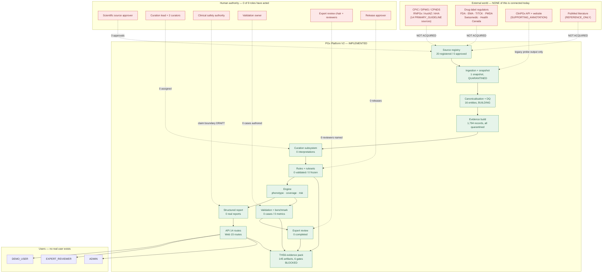
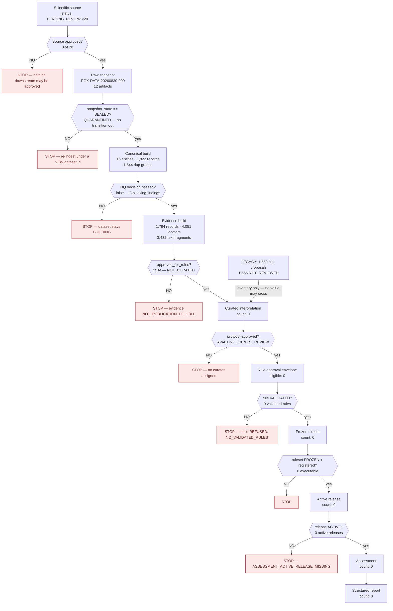
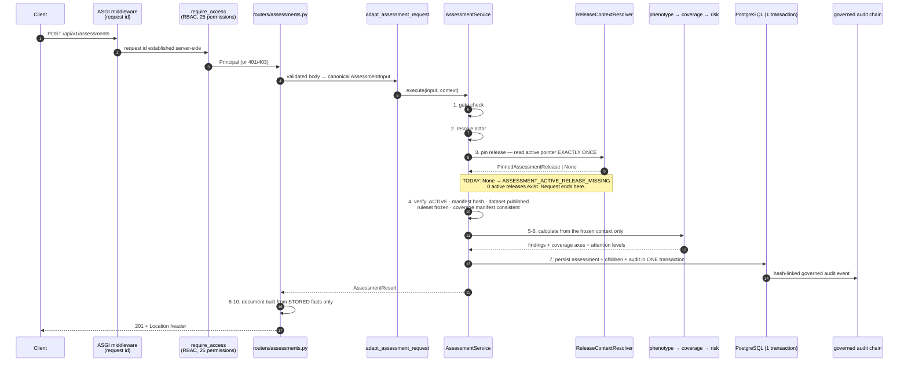
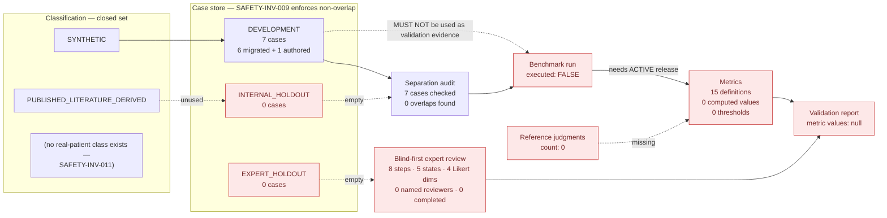
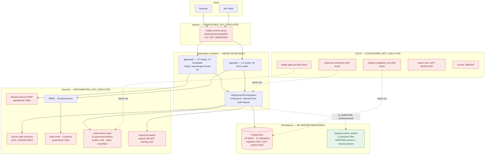
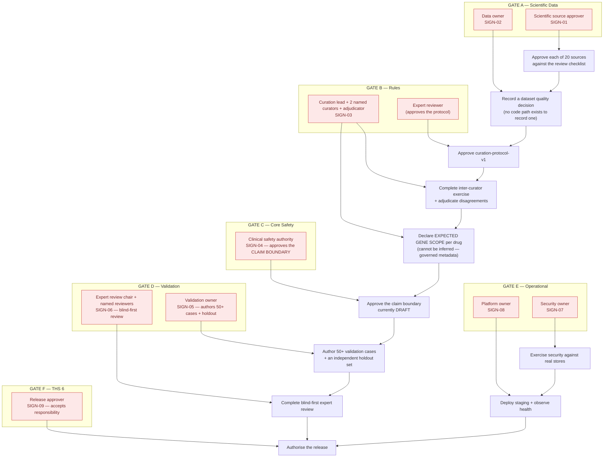

# PGx Platform V2 — Current-State Architecture

**Audit type:** read-only architecture reconstruction
**Audit date:** 2026-09-05 (UTC)
**Method:** every statement below is derived from repository content or from a
recorded command. Planning documents were not treated as evidence of
implementation.

---

## 0. Executive summary

The repository contains a **complete, unusually disciplined P0 software
platform** and **almost no executed scientific, human or operational
evidence**. Those two facts are not in tension: the software was built to
refuse to produce results from unapproved content, and it is currently
refusing, correctly, across the entire pipeline.

Measured shape of the codebase:

| Dimension | Count |
|---|---|
| `pgx/` modules / lines | 319 / 110,495 |
| `apps/` modules / lines | 63 / 16,459 |
| Test files / lines | 270 / 90,928 |
| Published JSON schemas | 137 |
| Committed data artifacts (JSON) | 101 |
| Documentation files (`.md`) | 165 |
| Alembic migrations | 11 (`0001` … `0011`) |
| SQLAlchemy tables | 44 |
| API routes | 14 |
| Web routes / templates | 15 / 14 |
| Console entry points | 21 |
| Legacy root scripts | 7 |

Measured shape of the *content*:

| Dimension | Count |
|---|---|
| Registered scientific sources | 20 |
| **Approved** scientific sources | **0** |
| Canonical entities (drugs / genes) | 16 (11 drugs, 5 genes) |
| Evidence records (quarantined legacy migration) | 1,794 |
| Curated interpretations | **0** |
| Validated rules / frozen rulesets / executable rulesets | **0 / 0 / 0** |
| Real assessments / reports | **0 / 0** |
| Validation cases / holdout cases | **0 / 0** |
| Completed expert reviews | **UNKNOWN — no review store was inspected (null, not zero)** |
| Active releases | **0** |
| Gates A–F passing | **0 of 6** |

The honest one-line summary: **the machine is built and has never been fed.**

### The single most important architectural fact

The pipeline is **hard-gated at every stage by provenance requirements that
cannot be satisfied by code**. This is not a soft policy. A `computable-rule`
document is refused unless its `provenance` block carries all fifteen of:

```
interpretation_id, curation_work_item_id, curation_revision_id,
curation_revision_hash, approval_envelope_hash, protocol_version,
protocol_content_hash, dataset_public_id, canonical_build_key,
canonical_build_content_hash, evidence_build_key,
evidence_build_content_hash, source_policy_version,
source_policy_content_hash, evidence_record_uuids
```

`approval_envelope_hash`, `protocol_content_hash` and
`source_policy_content_hash` are the three that matter: none of them can
exist until a named human approves a protocol, a source policy and a rule.
Everything downstream — rulesets, coverage, assessment, report, release,
demo — inherits that block.

That design decision is the reason the platform reports zero everywhere, and
it is also the strongest thing about it.

---

## 1. Layer-by-layer reconstruction

The planned flow in the brief is broadly correct. Two corrections from the
implementation:

1. **Curation sits between evidence and rules as a *blocking* stage with its
   own persistence, roles, revisions, reviews and adjudications** — it is not
   a step, it is a subsystem (`pgx/curation/`, 19 modules, 7,863 lines; 9 of
   the 44 tables).
2. **Coverage is a peer of assessment, not a sub-step of it.** It has its own
   manifest, its own approval requirement (declared expected gene scope) and
   its own gate artifact. The engine computes coverage *and* risk and reports
   them on separate axes, by design.

### 1.1 Scientific sources — `pgx/scientific/` (9 modules, 3,505 lines)

| Aspect | Reconstructed behaviour |
|---|---|
| Responsibility | Hold the closed registry of sources, their licence/reuse terms, the permitted claim categories, and the blocking reasons that keep each unapproved. |
| Inputs | `config/scientific-sources.json` (20 entries); legacy source-hint inventory. |
| Outputs | Source policy status; per-source `blocking_reasons`. |
| Persistence | `source_registry` table (schema exists; no rows — no database). |
| Versioning | `schema_version` + `source_policy_content_hash` consumed downstream. |
| Failure mode | Fails closed: **all 20 sources are `PENDING_REVIEW`**, 0 have a review record, 0 have an interpretation, 0 have a licence identifier. 17 of 20 have `acquisition_mode: NOT_DETERMINED`. All 17 evidence entries are `NOT_OBTAINED`. |
| Safety boundary | `permitted_claim_categories` is empty for every source, so no source currently authorises any claim. |

Source roles: 14 `PRIMARY_GUIDELINE`, 2 `SUPPORTING_ANNOTATION`, 3
`INTERNAL_SYSTEM`, 1 `REFERENCE_ONLY`. The primary guideline set names CPIC
(3 entries), DPWG/KNMP, CPNDS, RNPGx, AusNZ, AHA and six drug-label
regulators (FDA, EMA, TITCK, PMDA, Swissmedic, Health Canada).

### 1.2 Ingestion & raw snapshots — `pgx/ingestion/` (16 modules, 5,551 lines)

| Aspect | Reconstructed behaviour |
|---|---|
| Responsibility | Capture immutable, hash-sealed snapshots of source responses with a deterministic request log. |
| Inputs | ClinPGx API (via legacy probe output only — no live acquisition run exists). |
| Outputs | `data/raw/clinpgx-legacy-v2/PGX-DATA-20260830-900/` — 12 artifacts. |
| Persistence | Filesystem, content-addressed; `snapshot_content_hash` + `manifest_hash`. |
| Versioning | One-way lifecycle `SnapshotState`: `STAGING → SEALED` or `→ QUARANTINED`. **There is no transition out of either.** |
| Failure mode | The only snapshot is `QUARANTINED`, `snapshot_kind: LEGACY_IMPORT`, `complete: false`. |
| Safety boundary | A quarantined snapshot may be *examined* but its derivatives carry the quarantine label forward. |

**Consequence worth stating plainly:** `PGX-DATA-20260830-900` can never
become `SEALED`. Reaching a sealed snapshot requires a *new dataset
identifier* and a real acquisition run. Every downstream artifact built on
this snapshot is therefore permanently labelled.

### 1.3 Canonicalisation & data quality — `pgx/normalization/` (13 modules, 6,251 lines)

| Aspect | Reconstructed behaviour |
|---|---|
| Responsibility | Extract records, normalise identifiers, deduplicate, allocate canonical UUIDs, produce a data-quality report. |
| Inputs | The quarantined snapshot. |
| Outputs | `data/canonical/PGX-DATA-20260830-900/` — manifest, identity allocation (16 entities), DQ report, legacy differences. |
| Persistence | Filesystem + `genes`, `drugs`, `gene_aliases`, `drug_aliases`, `dataset_versions` tables. |
| Versioning | Seven pinned rule versions (`pgx-normalization/1`, `pgx-dedup/1`, `pgx-resolver/1`, `pgx-extraction/1`, `pgx-artifact-roles/1`, `pgx-identity-allocation/1`, `pgx-canonical-build/1`). |
| Failure mode | DQ gate `passed: false` with three **blocking** findings: `SNAPSHOT_NOT_ACQUIRED`, `SNAPSHOT_QUARANTINED`, `SOURCE_POLICY_MISSING`. |
| Safety boundary | `dataset_lifecycle_state: BUILDING`; the module explicitly provides **no way to record a quality decision**. |

Real measured content: 1,822 distinct records, 3,466 observations, 1,644
semantic duplicate groups, **16 canonical entities** (11 drugs, 5 genes),
8,182 candidate-edge records deliberately excluded as out of P0 scope.

The 16 entities are the entire scientific universe of this platform today:

```
DRUGS (11)  amitriptyline · citalopram · clopidogrel · codeine · fluoxetine
            omeprazole · paroxetine · sertraline · tamoxifen · voriconazole
            warfarin
GENES  (5)  CYP1A2 · CYP2C9 · CYP2C19 · CYP2D6 · CYP3A4
```

### 1.4 Evidence — `pgx/evidence/` (12 modules, 5,338 lines)

| Aspect | Reconstructed behaviour |
|---|---|
| Responsibility | Turn canonical records into `EvidenceRecord`s that say *what a source stated and where*, with locators and text fragments. |
| Inputs | Canonical build. |
| Outputs | `data/evidence/PGX-DATA-20260830-900/` — 7 NDJSON/JSON files. |
| Persistence | `evidence_records`, `interpretation_evidence`, `rule_evidence` tables. |
| Versioning | `evidence_build_key` + `evidence_build_content_hash`. |
| Failure mode | `mode: LEGACY_MIGRATION`; 3,235 blocking issues out of 3,486 total. |
| Safety boundary | `lifecycle_labels: [QUARANTINED, LEGACY_MIGRATION, NOT_CURATED, NOT_EXECUTABLE, NOT_PUBLICATION_ELIGIBLE]`; `production_eligible: false`; `production_eligible_record_count: 0`. |

Measured: 1,794 evidence records, 4,051 locators, 4,284 entity links (1,946
gene, 2,338 drug), 3,432 text fragments, 1,952 publication references, 1,797
identified publications. **All 1,794 are quarantined.**

### 1.5 Curation — `pgx/curation/` (19 modules, 7,863 lines)

| Aspect | Reconstructed behaviour |
|---|---|
| Responsibility | A full governed workflow: work items, roles, revisions, reviews, adjudications, provenance verification, approval envelopes. |
| Inputs | Evidence records; the curation protocol document. |
| Outputs | Curated interpretations → rule approval envelopes. |
| Persistence | 9 tables (`curation_work_items`, `curated_interpretations`, `curation_revisions`, `curation_reviews`, `curation_adjudications`, `curation_role_assignments`, `curation_provenance_verifications`, `curation_work_item_evidence_links`, `interpretation_evidence`). |
| Versioning | `protocol_version` + `protocol_content_hash`, both required in rule provenance. |
| Failure mode | Protocol status `AWAITING_EXPERT_REVIEW`; the inter-curator exercise is `AWAITING_HUMAN_CURATORS` with **0 curators assigned, 0 responses completed, no adjudicator**. |
| Safety boundary | 1,559 legacy proposals sit in a review queue where **1,556 are `NOT_REVIEWED`** and 3 are only `SELECTED_FOR_EXERCISE`. The inventory's own note refuses to let legacy values enter a curation conclusion. |

**0 curated interpretations. 0 eligible rule approval envelopes.**

### 1.6 Rules & rulesets — `pgx/rules/` (15 modules, 4,716 lines)

| Aspect | Reconstructed behaviour |
|---|---|
| Responsibility | Condition language, rule lifecycle (`DRAFT → CURATED → VALIDATED → DEPRECATED`), ruleset build and freeze (`BUILDING → VALIDATED → FROZEN → RETIRED`), executable registry. |
| Inputs | Approved curated interpretations. |
| Outputs | Frozen ruleset artifacts. |
| Persistence | `computable_rules`, `ruleset_versions`, `ruleset_rules`, `ruleset_builds`, `ruleset_approvals`, `rule_lifecycle_events`, `rule_evidence`. |
| Versioning | `family_id` + `rule_version` + `supersedes_rule_id` lineage; `content_hash` per rule. |
| Failure mode | A **real build was attempted and refused**: `data/rulesets/wp11-real-build-attempt.json` records `outcome: REFUSED`, `stopped_at: NO_VALIDATED_RULES`. |
| Safety boundary | The 15-field provenance requirement described in §0. |

Rule condition shape: `{kind, gene_id, drug_id, phenotype}`. Outcome shape:
`{attention_level ∈ {NO_ACTIVE_ATTENTION, LOW, MEDIUM, HIGH}, rationale_reference}`.

**0 draft, 0 curated, 0 validated, 0 deprecated rules. 0 frozen rulesets.
0 executable rulesets in the default registry. 33 of 1,559 legacy candidates
are still unlinked.**

### 1.7 Engine: phenotype, coverage, risk — `pgx/engine/` (16 modules, 5,301 lines)

Three separable engines sharing a legacy-regression harness each.

**Phenotype** (`phenotype.py`, `phenotype_normalization.py`,
`phenotype_models.py`): exact matching only. `Phenotype` is a closed 6-value
enum — `POOR, INTERMEDIATE, NORMAL, RAPID, ULTRARAPID, INDETERMINATE`.
`SAFETY-INV-004` enforces that **RAPID must not implicitly match
ULTRARAPID**, and it is `COMPLIANT` with 3 negative controls.

**Coverage** (`coverage.py`, `coverage_manifest.py`, `coverage_validator.py`):
`CoverageStatus ∈ {FULL, PARTIAL, INSUFFICIENT, UNSUPPORTED_DRUG,
UNSUPPORTED_PHENOTYPE, SOURCE_CONFLICT}` with 8 reason codes. The manifest
module states the architectural rule that drives the whole data-requirements
analysis:

> *Expected scope is declared, never inferred. … expected genes cannot come
> from the chemical catalogue, from every gene appearing in evidence, from
> guideline presence, from the existence of one rule, or from a legacy CSV
> row. They are governed scientific metadata and require a named human
> declaration.*

**Risk** (`risk.py`, `risk_models.py`): deterministic, produces
`AttentionLevel ∈ {NOT_ASSESSED, NO_ACTIVE_ATTENTION, LOW, MEDIUM, HIGH}`.
`NOT_ASSESSED` exists so that missing data has somewhere to go that is not
`LOW` — that is `SAFETY-INV-001`, `COMPLIANT`, 2 negative controls.

### 1.8 Assessment & reporting — `pgx/application/`, `pgx/reporting/`

The assessment service (`pgx/application/assessment_service.py`) implements a
10-step pipeline whose steps 1–4 are pure refusal:

```
1. gate check
2. resolve actor
3. PIN THE RELEASE — read the active pointer exactly ONCE
4. VERIFY the pinned context: release ACTIVE, manifest hash matches,
   dataset published, ruleset frozen, coverage manifest true of both
   → fail closed on any mismatch
5-7. calculate, then persist assessment + children + audit event in ONE
     transaction, or raise
8-10. build the response document from the STORED facts only
```

Refusal codes observed: `ASSESSMENT_ACTIVE_RELEASE_MISSING`,
`ASSESSMENT_RELEASE_NOT_ACTIVE`, plus artifact-mismatch errors.

Reporting produces a `StructuredReport` scanned by a prohibited-claim scanner
(`claim-scanner/0.1.0`) before release. Default locale `tr`.
`llm_enabled: false`, `llm_provider_implemented: false` — the LLM gateway is
a *declared absence*, and `SAFETY-INV-002` is `NOT_PRESENT` by design with
P1 named as its owner.

**0 real assessments. 0 real reports. 0 published artifacts.
`may_publish_real_reports: false`. `synthetic_only: true`.**

### 1.9 API & Web — `apps/api/` (36 modules), `apps/web/` (26 modules)

14 API routes, 15 web routes, 14 templates, 45 error codes, 43 contract
models, 0 stub operations.

Readiness is explicit: **7 blocking components** (`configuration`,
`database`, `migrations`, `active_release`, `claim_boundary`,
`authentication`, `service_composition`) and 1 advisory (`evidence_build`),
with 21 declared detail states. In this repository all seven are unmet.

The framework boundary is enforced structurally: `fastapi`/`pydantic`/
`uvicorn` are optional extras, and a test reads every module in `pgx/` as a
syntax tree to prove the scientific layers import none of them.

### 1.10 Validation, benchmark, expert review — `pgx/validation/`, `pgx/expert_review/`

Case roles are a closed, non-overlapping set: `DEVELOPMENT`,
`INTERNAL_HOLDOUT`, `EXPERT_HOLDOUT`, with `SAFETY-INV-009` enforcing
non-overlap. Classification is `SYNTHETIC` or
`PUBLISHED_LITERATURE_DERIVED` — **there is no classification for real
patient data**, and `SAFETY-INV-011` enforces that real patient or genomic
data must not enter P0.

Expert review implements an 8-step blind-first workflow across 7 tables with
5 review states, 18 error codes and 4 Likert dimensions.

**7 development cases (6 migrated + 1 authored). 0 internal holdout.
0 expert holdout. 0 computed metric values. 0 reference judgments.
0 thresholds. 15 metric definitions, 10 failure paths.**

### 1.11 Safety, verification, security, deployment, evidence pack

- **Safety** (`pgx/safety/`): 12 registered invariants, all 12 executed, 37
  negative controls, all 37 detected. 7 `PASS`, 5 `BLOCKED` (2 by P1 scope,
  2 by WP-24 operations, 1 by scientific curators). 0 unexplained skips,
  0 false-reassurance violations across a 36-item corpus.
- **Verification** (`pgx/verification/`): 13 profiles, 8 reproducibility
  generators, 16 critical requirements. Its own run evidence is
  self-rejected as `STALE_EVIDENCE_REJECTED`.
- **Security** (`pgx/security/`): 25 permissions, 41 governed audit actions,
  5 rate-limit policies, hash-linked audit chain. Secret scan `CLEAN`,
  0 findings over 1,295 files, 31 classified.
- **Deployment** (`pgx/deployment/`): Dockerfile, compose topology, 3 CI
  workflows, 21 release-validation gates of which **19 are required and 2 are
  satisfied**.
- **Evidence pack** (`pgx/ths6/`): 145 inventoried artifacts, 24 claims,
  6 gates, 15 DoD items, 20 schemas, 12 artifacts, 22 documents.

---

## 2. Architecture diagrams

### A. System context



### B. Data / evidence flow, with the real gate at each hop



**Every gate in this diagram is currently closed at the first one.**

### C. Runtime assessment flow — the real path of one request



Two properties worth naming: the active-release pointer is read **once**
(so a mid-request activation cannot split a result), and the response is
built from **persisted** facts (so a document can never describe something
that failed to store).

### D. Validation architecture



The separation audit passes over 7 development cases. **With zero holdout
cases it is a check with nothing to separate them from** — a true statement
that carries no validation weight.

### E. Deployment / operational architecture



### F. Human-in-the-loop architecture



**Zero of these ten roles has acted.** The sign-off matrix
(`data/ths6/wp25-signoff-matrix.json`) records 9 roles, `signed_count: 0`,
and `signature_mechanism: null` — the repository contains no command, flag or
helper that can record a signature, by design.

---

## 3. Legacy ↔ V2 relationship

### 3.1 Classification

| Artifact | Lines | Classification | Evidence |
|---|---|---|---|
| `clinpgx_probe.py` | 357 | `DEPRECATED` | Standalone `__main__`, 3 network call sites, imports no `pgx.*`. Superseded by `pgx/ingestion/`. Nothing imports it. |
| `clinpgx_probe_v2.py` | 697 | `REGRESSION_ONLY` | Same shape; its *output* (`clinpgx_outputs_v2/`) is the sole input of the one snapshot. The script itself is never invoked by V2. |
| `clean_mvp_seed_dataset.py` | 1,125 | `REGRESSION_ONLY` | Produced `clinpgx_mvp_seed/*.csv.bak`; those `.bak` files are read only by `pgx/normalization/legacy_diff.py` for difference reporting. |
| `risk_engine.py` | 976 | `REGRESSION_ONLY` | Imported **only** by `tests/unit/engine/test_legacy_regression.py` (3 sites). No `pgx/` or `apps/` module imports it. |
| `gemini_report_generator.py` | 556 | `DEAD` | Nothing imports it. `final_report/` holds its four output files. The LLM path is `NOT_PRESENT` by design (`SAFETY-INV-002`). |
| `candidate_onboarding.py` | 1,072 | `DEAD` (P1 scope) | 4 network call sites. Its output domain (candidate edges) is explicitly excluded: `excluded_record_counts.candidate_edge = 8,182`. |
| `alternative_ranker.py` | 639 | `DEAD` (P1 scope) | Produces `candidate_alternatives.csv` (5 lines). `SAFETY-INV-005` records candidate exploration as `NOT_PRESENT`, P1-owned. |
| `clinpgx_mvp_seed/` (6 files) | 3,267 lines | `COMPATIBILITY_ONLY` | Read by `legacy_diff.py`, `draft_curation.py`, `scientific/inventory.py`, `phenotype_legacy.py` — all migration/inventory paths. |
| `clinpgx_outputs_v2/` (12 files) | — | `MIGRATED` | The content behind the quarantined snapshot. |
| `clinpgx_outputs/` | — | `DEPRECATED` | v1 probe output; superseded by v2. |
| `final_report/` (4 files) | — | `DEAD` | Legacy LLM report artifacts. |
| `candidate_alternatives.csv`, `drug_graph_edges.csv` | 5, 23 | `DEAD` (P1 scope) | Candidate/alternative domain, excluded from P0. |

### 3.2 Can a legacy path bypass the governed V2 flow?

**Audited answer: NO, with one caveat that is itself governed.**

Three checks were run:

1. **No `pgx/` or `apps/` module imports any legacy root script.** The only
   importers are `tests/unit/engine/test_legacy_regression.py` (3 sites,
   importing `risk_engine`).
2. **The serving path (`apps/`) contains exactly three legacy references**,
   all in build-time code:
   - `apps/web/demo_cases.py` — a docstring only.
   - `apps/web/demo_migration.py` — reads
     `clinpgx_mvp_seed/mvp_demo_profiles.json`. Its own docstring states:
     *"Run once by the artifact generator; never at request time. The output
     is `data/demo/wp17-development-cases.json` and its manifest, and the
     interface reads only those."* It is reached only from
     `apps/web/artifacts.py`, which is the generator.
3. **The image forbids legacy content at runtime.**
   `pgx/deployment/runtime_assets.py` lists `clinpgx_outputs/`,
   `clinpgx_outputs_v2/`, `clinpgx_mvp_seed/`, `final_report/`, `tests/` and
   `data/_to_delete/` in `FORBIDDEN_IMAGE_PREFIXES`, checked *after* build
   against a real listing rather than trusted to `.dockerignore`.

**The caveat, stated precisely:** the legacy migration path is not a bypass
but it *is* the origin of every scientific byte in the repository. The one
snapshot is `LEGACY_IMPORT`, the evidence build is `LEGACY_MIGRATION`, and
1,559 legacy interpretations sit in a review queue. The governance holds —
none of those values may enter a rule — but it means the platform's entire
data inheritance is from an unreviewed prototype, and the first sealed
dataset must come from a *new* acquisition run, not from promoting this one.

What migration deliberately did **not** carry across is worth recording:
`demo_migration.py` refuses to migrate the legacy `demo_use` free text
because *"it associates a medicine with a phenotype, which is the association
the governed ruleset exists to make and this catalogue has no standing to."*

---

## 4. Commands executed during this audit

All read-only. Nothing was modified.

| # | Command | Exit | Result | Timestamp (UTC) |
|---|---|---|---|---|
| 1 | `ls`, `find`, `wc` inventory sweeps over `pgx/`, `apps/`, `tests/`, `docs/`, `schemas/`, `data/` | 0 | Counts in §0 | 2026-09-05T16:21:27Z |
| 2 | `python3 -c "from apps.api.routes import ROUTES"` | 0 | 14 routes, 0 stub operations | 2026-09-05T16:21Z |
| 3 | `python3 -c "from apps.web.routes import WEB_ROUTES"` | 0 | 15 routes | 2026-09-05T16:21Z |
| 4 | `python3 -c "from pgx.infrastructure.db.base import metadata"` (all db modules imported) | 0 | 44 tables | 2026-09-05T16:22Z |
| 5 | JSON reads of all 14 gate-status artifacts + registry/dataset/evidence/curation manifests | 0 | Numbers in §1 and `THS6_GAP_ANALYSIS.md` §2 | 2026-09-05T16:22–16:24Z |
| 6 | `grep`/`ast` legacy-import and legacy-path reachability sweep | 0 | §3.2 | 2026-09-05T16:23Z |
| 7 | `git -C <repo> log/status/ls-files/tag` on the authoritative repository | 128 on `log` (no commits) | branch `main`, **0 commits, 0 tracked files, 0 tags, 0 remotes, 1,720 untracked** | 2026-09-05T16:23Z |
| 8 | `python3 -W error::ResourceWarning -m unittest discover -s tests -p 'test_*.py' -t .` | **0** | **Ran 7247 tests — OK (skipped=33)**, 471.3 s | 16:24:23Z → 16:32:23Z |

No command failed in a way that changed the audit's conclusions. Command 7's
non-zero exit is itself a finding, recorded in the capability matrix as
`git provenance: MISSING`.

**Read-only verification.** After the audit, all 1,380 pre-existing files
were re-hashed and compared against their pre-audit digests: identical
(`edadd6a62921f5c369adb7972c7c0768`). The only additions are the five audit
documents.

One disclosure: running the full suite (command 8) regenerated
`tests/fixtures/wp17/browser/system.png`, because the browser end-to-end
suite writes captures while a launched browser is serving the pages. The
byte-identical committed copy was restored from the authoritative repository
rather than left changed, since a screenshot regenerated only to change its
timestamp is not evidence of anything.

---

## 5. What this architecture gets right

Stated because an audit that only lists gaps misrepresents the object.

1. **Refusal is structural, not procedural.** The 15-field rule provenance
   requirement means an ungoverned rule is not merely discouraged — it cannot
   be serialised.
2. **`null` and `0` are kept apart everywhere.** `validation_metric_count:
   null` carries the source note *"null rather than zero: metrics are
   implemented and no benchmark has been executed"*. A zero would have
   claimed a run produced nothing.
3. **Coverage cannot be derived from the rules that happen to exist.** This
   is the single best scientific design decision in the repository: deriving
   expected scope from existing rules would make every drug look exactly as
   covered as its rules make it, and no gap would ever be visible.
4. **The framework boundary is proved by AST inspection**, not by convention.
5. **Real-patient data is structurally excluded**, not policy-excluded: the
   case model has no field in which genotype or raw sequencing could be
   recorded at any depth.
6. **Every count in every artifact is read, not asserted**, and each artifact
   says so.

---

## 6. What is not verified

- **Any behaviour requiring PostgreSQL.** 44 tables and 11 migrations exist;
  none has been applied to a server in this environment. `NOT VERIFIED`.
- **Any behaviour requiring a container runtime, a package index, a CI
  provider or a staging host.** `NOT VERIFIED`.
- **Argon2 password hashing.** `argon2-cffi` is not installed. `NOT VERIFIED`.
- **The number of completed expert reviews.** No review store was inspected;
  the artifacts record `null`. `UNKNOWN / NO EXECUTABLE EVIDENCE`.
- **Whether the 20 registered sources are the right 20.** That is a
  scientific judgement, not a repository fact.
