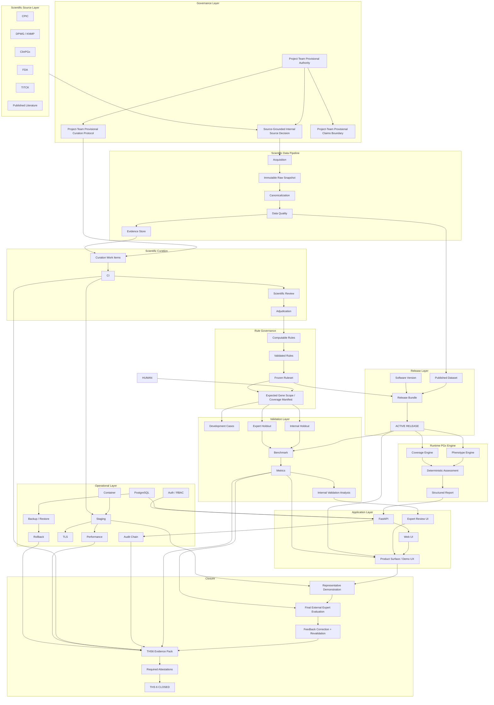
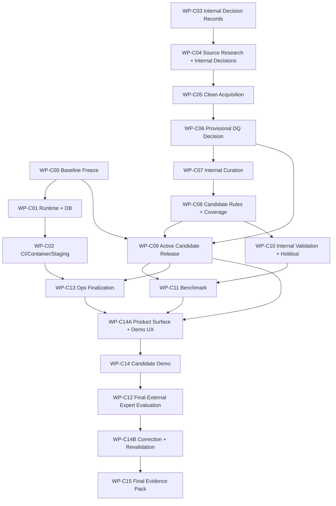

# PGx Platform V2 — Final THS-6 Closure Architecture & Work Packages

**Purpose:** Close the existing PGx Platform V2 as a defensible THS-6 prototype.  
**Mode:** Closure / execution phase. No unnecessary feature expansion.  
**Core principle:** The software platform already exists; the project team now completes a source-grounded, internally validated candidate prototype first, then obtains real whole-project external expert evaluation, applies corrections, revalidates, and closes the final evidence pack.

**Current execution policy:** [`docs/closure/current-execution-policy.md`](docs/closure/current-execution-policy.md). Historical checkpoint and wave artifacts retain the policy and facts that applied when they were produced.

---

# 1. Mission

The goal of this phase is to move the project from:

```text
ENGINEERING-COMPLETE
SCIENTIFICALLY-EMPTY
OPERATIONALLY-UNEXECUTED
THS6-BLOCKED
```

to:

```text
SCIENTIFICALLY-GOVERNED
INTERNALLY-VALIDATED
FUNCTIONALLY-COMPLETE-CANDIDATE
PENDING-EXTERNAL-EXPERT-REVIEW
↓
EXPERT-REVIEWED
CORRECTED-AND-REVALIDATED
OPERATIONALLY-EXECUTED
AUDITABLE
RELEASED
THS6-DEFENSIBLE
```

This is not a redesign phase.

This is not a feature-expansion phase.

This is the final closure phase for the current THS-6 objective.

---

# 2. Candidate and Final Completion Definitions

## 2.1 Complete candidate prototype

Intermediate external approval is not required to build the candidate. The candidate is complete when:

```text
Scientific decisions = SOURCE_GROUNDED_INTERNAL_DECISION
Authority state = PROJECT_TEAM_PROVISIONAL + PENDING_EXTERNAL_EXPERT_REVIEW

Dataset = SEALED + PROJECT_TEAM_PROVISIONAL quality decision
Interpretations = SOURCE-GROUNDED + PROJECT_TEAM_PROVISIONAL
Ruleset = FROZEN + EXECUTABLE in DEMO/VALIDATION candidate mode
Candidate release = ACTIVE in DEMO/VALIDATION mode
Internal validation benchmark = EXECUTED
Operational evidence = RECORDED to the extent available
Product Surface / Demo UX = CLOSED
Representative candidate workflow = EXECUTED through the browser
```

At this point the project may be described as a source-grounded, deterministic, internally validated research prototype. It may not be described as clinically validated, independently validated or externally expert-approved.

## 2.2 Final THS-6 closure

The project is considered finally closed for the THS-6 objective only after the complete candidate has received real external expert evaluation and the post-review correction loop is complete:

```text
Gate A = PASS
Gate B = PASS
Gate C = PASS
Gate D = PASS
Gate E = PASS
Gate F = PASS

Definition of Done = 15 / 15

Representative workflow = EXECUTED

Final candidate release = ACTIVE

Scientific sources = SOURCE-GROUNDED DECISIONS RECORDED

Dataset = SEALED + FINAL POST-REVIEW DISPOSITION

Ruleset = FROZEN + EXECUTABLE

Validation benchmark = EXECUTED

Expert review = COMPLETED

Expert feedback = CLASSIFIED + INCORPORATED OR RATIONALLY DISPOSITIONED

Affected validation = RERUN

Operational evidence = RECORDED

Required attestations = COMPLETE

ths6_achieved = true
release_may_proceed = true
```

---

# 3. Closure Execution Model

Cowork acts as the **closure orchestrator**.

Its responsibility is to:

```text
inspect
→ research
→ record source-grounded internal decisions
→ implement
→ execute
→ validate
→ collect evidence
→ detect blockers
→ complete the candidate project
→ prepare one late whole-project expert evaluation
→ preserve and classify real feedback
→ correct and revalidate
→ rebuild the THS6 evidence pack
```

Cowork must not stop at producing TODO documents.

When a task is executable by the agent, it should be executed.

Missing intermediate external human approval does not stop candidate development. Cowork must instead:

1. retrieve and compare the strongest authoritative evidence available,
2. record a replaceable internal decision with rationale, provenance, uncertainty and conflicts,
3. mark it `SOURCE_GROUNDED_INTERNAL_DECISION` or `PROJECT_TEAM_PROVISIONAL`,
4. also mark it `PENDING_EXTERNAL_EXPERT_REVIEW`,
5. fail closed when uncertainty cannot be represented safely,
6. continue through the candidate scientific pipeline.

External access, licensing restrictions, real-patient-data prohibitions and unsafe unresolved ambiguity remain hard blockers for the affected action. They are not waived by the candidate-first policy.

---

# 4. Authority Classes

## CLASS A — Autonomous Agent Work

Cowork can complete these fully:

- code changes required by an existing blocker,
- migrations,
- tests,
- public-source research,
- scientific-source metadata collection,
- dataset acquisition,
- normalization,
- evidence extraction,
- source-grounded internal source and governance decisions,
- project-team provisional dataset-quality decisions,
- source-grounded internal curation,
- provisional computable-rule generation and candidate ruleset freezing,
- provisional expected-gene-scope declarations,
- internal validation/reference-judgment records and holdout assignment,
- benchmark execution,
- metric calculation,
- CI/deployment execution,
- Docker image build,
- TLS verification,
- backup/restore drills,
- rollback drills,
- performance testing,
- artifact generation,
- evidence-pack rebuilding.

## CLASS B — External Access Required

Cowork can execute after access is provided:

- GitHub / Git remote,
- PostgreSQL server,
- package registry,
- container runtime,
- staging host,
- domain / DNS,
- TLS / certificate infrastructure,
- cloud credentials,
- CI provider.

Cowork should report:

```text
BLOCKED_BY_EXTERNAL_ACCESS

Required:
...

Why:
...

Exact credential/action needed:
...
```

and continue unrelated tracks.

## CLASS C — Real External Human Authority Required at Final Evaluation

Class C does not block construction or internal validation of the complete candidate prototype. It blocks only claims of external review/approval and final post-review closure.

Examples:

- whole-project external scientific evaluation,
- authentic expert comments, scores and credentials,
- any claim of independent expert or clinical validation,
- final attestations.

Cowork may prepare the evaluation package and workflow but must not impersonate the external expert, invent feedback or sign any attestation.

## Authority-state vocabulary

Before final external evaluation, use:

```text
SOURCE_GROUNDED_INTERNAL_DECISION
PROJECT_TEAM_PROVISIONAL
PENDING_EXTERNAL_EXPERT_REVIEW
INTERNAL_VALIDATION
LITERATURE_DERIVED_VALIDATION
SOFTWARE_VERIFICATION
```

Do not use before the evidence exists:

```text
EXPERT_APPROVED
PHYSICIAN_APPROVED
CLINICALLY_VALIDATED
INDEPENDENTLY_VALIDATED
EXTERNAL_REVIEWED
```

### Candidate authority-state bridge

Existing fields whose semantics mean a real external human approval, signature or independent review must keep that meaning. Do not populate them with an AI identity or silently redefine `APPROVED` to mean provisional.

Where the implementation currently hard-blocks candidate execution on such a field, add the smallest backward-compatible authority-state path that:

- records `SOURCE_GROUNDED_INTERNAL_DECISION` or `PROJECT_TEAM_PROVISIONAL`,
- records the decision author as the project team or automated research workflow without impersonation,
- pins evidence and artifact hashes,
- carries `PENDING_EXTERNAL_EXPERT_REVIEW`,
- enables only DEMO/VALIDATION candidate behavior,
- leaves production/clinical and final-expert gates fail-closed,
- allows a later expert-reviewed decision to supersede rather than erase the provisional record.

Candidate readiness and final THS-6 closure are separate evaluations. A candidate-ready result must never be emitted as final expert-reviewed gate evidence.

---

# 5. Master Architecture



---

# 6. Track Model

The closure phase runs across five tracks.

## Track A — Foundation & Operations
Git, DB, migrations, runtime, CI, Docker, staging, TLS, backup/restore, rollback, security, performance.

## Track B — Governance
Source policy, curation protocol, claims boundary, named authorities.

## Track C — Scientific Content
Source acquisition, clean dataset, evidence, curation, validated rules, coverage scope.

## Track D — Validation
Validation cases, internal holdout, cases reserved for final expert evaluation, internal benchmark, metrics.

## Track E — Expert / Final Closure
Product-surface and demo-UX closure, representative candidate demo, final whole-project external expert evaluation, correction/revalidation, final evidence pack, attestations.

---

# 7. First Candidate Release Scope

The first candidate release should remain deliberately small and must stay in DEMO/VALIDATION operation modes until final review supports anything broader.

## Genes

```text
CYP2C19
CYP2D6
```

## Drugs

```text
clopidogrel
codeine
omeprazole
amitriptyline
```

## Gene–Drug Evidence Axes and Decision Units

```text
CYP2C19 × clopidogrel
CYP2C19 × omeprazole
CYP2C19 × amitriptyline
CYP2D6 × codeine
CYP2D6 × amitriptyline
```

The two amitriptyline evidence axes are not independent clinical decisions. The candidate representation must use a joint CYP2C19 + CYP2D6 decision matrix when required by the authoritative source, and must fail closed if either required gene is absent.

## Phenotypes

```text
POOR
INTERMEDIATE
NORMAL
RAPID
ULTRARAPID
```

This is the cross-project vocabulary, not a declaration that every value applies to every gene. `RAPID` must not be treated as an expected CYP2D6 phenotype. Likely, indeterminate or unrepresentable activity-score states must remain explicit and fail closed rather than map to a neighbouring phenotype.

## Target Internally Validated Candidate Rules

```text
~20–25 rules
```

## Scientific Sources

Minimum source-grounded internal decision set:

```text
CPIC
DPWG
ClinPGx
```

Preferred future evidence expansion when access and terms permit:

```text
CPIC
DPWG
ClinPGx
FDA
TITCK
```

## Validation Target

```text
50+ validation cases
≥20 INTERNAL_HOLDOUT
≥10 CASES RESERVED FOR FINAL EXTERNAL EXPERT EVALUATION
```

---

# 8. Final Closure Work Packages

---

## WP-C00 — Baseline Freeze & Project Identity

**Track:** A — Foundation & Operations  
**Execution class:** A / B  
**Priority:** Immediate  
**Dependencies:** None

### Objective

Create a trustworthy software identity and freeze the starting point for all downstream closure evidence.

### Scope

- create the first real Git commit,
- configure Git identity,
- add remote if available,
- create initial tag/version,
- record repository status,
- resolve or explicitly classify the 33 unlinked legacy rule candidates,
- reconcile stale WP-17 status artifacts,
- capture a closure baseline manifest.

### Deliverables

- initial commit hash,
- first software version/tag,
- baseline manifest,
- repository-cleanliness report,
- disposition report for the 33 legacy candidates,
- corrected stale gate metadata.

### Acceptance Criteria

- software version can be referenced by a release bundle,
- no unknown repository baseline remains,
- all 33 candidates are either linked or dismissed with reason,
- baseline artifacts are hashed.

### THS Contribution

Removes unnecessary software-version blockers from release activation.

---

## WP-C01 — Runtime & Database Closure

**Track:** A  
**Execution class:** A / B  
**Dependencies:** WP-C00

### Objective

Execute the existing platform against real runtime infrastructure rather than fixtures/configuration only.

### Scope

- provision PostgreSQL,
- execute all migrations through latest revision,
- verify schema,
- create dependency lockfile,
- install required runtime extras,
- execute ASGI runtime verification,
- verify real API startup,
- verify web runtime,
- verify transaction paths,
- verify audit chain against real DB.

### Deliverables

- `uv.lock`,
- DB migration execution log,
- schema verification artifact,
- ASGI runtime verification artifact,
- API health/smoke evidence,
- audit-chain verification artifact.

### Acceptance Criteria

- latest migration executed successfully,
- API starts in a real runtime,
- committed OpenAPI and served OpenAPI match,
- application reaches real PostgreSQL,
- audit events persist and verify.

### THS Contribution

Converts major platform capabilities from `IMPLEMENTED_NOT_EXECUTED` to executed operational evidence.

---

## WP-C02 — CI, Container, Staging & Reliability Closure

**Track:** A  
**Execution class:** A / B  
**Dependencies:** WP-C00, WP-C01

### Objective

Prove that the platform can be reproducibly built, deployed, secured, restored, and rolled back.

### Scope

- resolve CI action pins,
- execute CI provider workflows,
- build package distributions,
- build container image,
- deploy staging,
- verify TLS,
- run secret scan,
- generate SBOM,
- run vulnerability scan,
- perform backup/restore drill,
- perform rollback drill between two valid images/releases where possible,
- prepare performance-run infrastructure.

### Deliverables

- green CI run,
- built wheel/sdist,
- container image digest,
- staging deployment record,
- TLS evidence,
- SBOM,
- vulnerability report + disposition,
- backup/restore evidence,
- rollback evidence.

### Acceptance Criteria

- required operational gates have execution artifacts,
- deployment is reproducible,
- backup and restore satisfy defined conditions,
- rollback is demonstrated,
- staging is reachable through TLS.

### THS Contribution

Closes major Gate E operational requirements.

---

## WP-C03 — Governance Decision Records & Final-Review Preparation

**Track:** B — Governance  
**Execution class:** A  
**Dependencies:** None

### Objective

Turn the source-policy, curation-protocol, claims-boundary and dataset-quality questions into transparent project-team decisions that can support candidate construction without pretending to be external approval.

### Candidate Decision Classes

1. Source policy: `SOURCE_GROUNDED_INTERNAL_DECISION`
2. Curation protocol and scope: `PROJECT_TEAM_PROVISIONAL`
3. Claims boundary and safety wording: `PROJECT_TEAM_PROVISIONAL`
4. Dataset quality: `PROJECT_TEAM_PROVISIONAL`

Every record also carries `PENDING_EXTERNAL_EXPERT_REVIEW`.

### Cowork Responsibilities

For each decision:

```text
internal-decision-record
├── decision identifier and version
├── exact source/protocol/artifact hashes
├── project-team authority state
├── rationale
├── uncertainty and conflicts
├── fail-closed behavior
├── replaced/superseded decision link
└── pending-external-expert-review marker
```

Historical H00–H04 checkpoint packages and any genuine prior human input remain immutable audit inputs. Blank signature forms remain blank.

### Acceptance Criteria

- every decision needed for candidate development has an explicit internal disposition,
- evidence, versions, rationale, uncertainty and conflicts are traceable,
- unsafe or unsupported cases fail closed,
- candidate execution no longer depends on an unsigned intermediate approval form,
- no record claims external or clinical approval,
- the eventual whole-project expert package can trace every provisional decision.

### THS Contribution

Enables the candidate scientific chain while preserving a truthful boundary between project-team decisions and final external expert evidence.

---

## WP-C04 — Scientific Source Research & Internal Decision Support

**Track:** B / C  
**Execution class:** A / B  
**Dependencies:** WP-C03 decision-record format may run in parallel

### Objective

Collect authoritative source metadata and scientific content required for the first candidate release.

### Scope

Primary target sources:

- CPIC,
- DPWG / KNMP,
- ClinPGx,
- FDA,
- TITCK.

For each source collect:

- canonical source identifier,
- organization,
- source role,
- URL / API / publication location,
- guideline or content version,
- access date,
- licence / terms,
- citation requirements,
- redistribution constraints,
- acquisition mode,
- supported PGx axes,
- evidence type,
- source-policy compatibility.

### Deliverables

- completed source registry candidates,
- licence/terms evidence,
- version identifiers,
- acquisition plan per source,
- source-grounded internal source decisions,
- inputs for the final external expert package.

### Acceptance Criteria

- minimum 3 source families have explicit internal dispositions,
- each usable source/interface has a known version, provenance, terms basis and permitted acquisition method,
- unknown-terms interfaces remain unusable even when their source family is scientifically relevant,
- source-policy content hash can be generated.

### THS Contribution

Enables permitted clean acquisition without misrepresenting the internal source decision as external scientific or legal approval.

---

## WP-C05 — Clean Scientific Acquisition & Sealed Dataset

**Track:** C — Scientific Content  
**Execution class:** A / B  
**Dependencies:** Eligible `SOURCE_GROUNDED_INTERNAL_DECISION` source/interface records from WP-C04

### Objective

Create the first legitimate V2 dataset from a new acquisition run.

### Scope

- create a new dataset ID,
- perform real source acquisition,
- store immutable raw artifacts,
- calculate checksums,
- seal snapshot,
- canonicalize drugs/genes,
- deduplicate,
- resolve entities,
- produce DQ report,
- build production-eligible evidence.

### Important Rule

Do **not** promote the quarantined legacy dataset.

A new dataset identifier is mandatory.

### Deliverables

- new dataset ID,
- SEALED snapshot,
- raw manifest,
- checksums,
- canonical dataset,
- DQ report,
- evidence build,
- source-to-evidence traceability.

### Acceptance Criteria

- snapshot state = SEALED,
- canonical build is reproducible,
- all in-scope entities resolve,
- DQ output contains no unhandled blocking issue,
- evidence is no longer inherited from quarantined legacy content.
- every acquired source/interface was permitted by a versioned internal decision and by its recorded access/reuse constraints,
- every scientific-content artifact remains `PENDING_EXTERNAL_EXPERT_REVIEW`.

### THS Contribution

Creates the first scientifically legitimate dataset chain.

---

## WP-C06 — Dataset Quality Decision Mechanism & Provisional Publication

**Track:** C  
**Execution class:** A implementation + project-team provisional decision  
**Dependencies:** WP-C05

### Objective

Ensure the system can record an immutable, source-bound dataset-quality decision and use a project-team provisional decision to advance the candidate dataset.

### Scope

Implement a governed `DatasetQualityDecision` mechanism.

Suggested fields:

```text
dataset_id
decision_author
authority_state
decision
rationale
reviewed_at
dq_artifact_hash
source_policy_hash
pending_external_expert_review
```

### Cowork Responsibilities

- implement the missing mechanism,
- add tests,
- wire it to dataset lifecycle,
- prepare the dataset-quality evidence for final external review.

### Project-Team Responsibility

The project team reviews acquisition completeness, provenance, schema validity, canonicalization, unresolved entities, ambiguity, source-policy compliance, integrity and reproducibility, then records:

```text
authority_state: PROJECT_TEAM_PROVISIONAL
decision: ACCEPTED
or
authority_state: PROJECT_TEAM_PROVISIONAL
decision: REJECTED

review_state: PENDING_EXTERNAL_EXPERT_REVIEW
```

This is an internal research decision, not independent data-owner approval.

### Deliverables

- dataset-quality decision schema/model/service,
- tests,
- review artifact,
- final candidate-published dataset state with provisional authority metadata.

### Acceptance Criteria

- a named project-team decision author can record a provisional decision,
- decision is immutable/audited,
- the decision binds the exact DQ artifact and source-policy hashes,
- a provisionally accepted dataset becomes candidate-release-eligible in DEMO/VALIDATION mode,
- no artifact describes it as independently approved.

### THS Contribution

Closes the candidate Gate A dataset-quality blocker while leaving final external evaluation explicit.

---

## WP-C07 — Source-Grounded Internal Scientific Curation

**Track:** C  
**Execution class:** A + project-team provisional scientific decision  
**Dependencies:** Project-team provisional curation protocol + production-eligible candidate evidence build

### Objective

Produce the first source-grounded, project-team provisional curated interpretations for the minimal candidate scope.

### Scope

Only curate the five first-release axes.

For each decision Cowork must prepare and resolve:

- evidence bundles,
- side-by-side source comparisons,
- proposed normalized interpretations,
- effect direction,
- clinical significance,
- metabolism/exposure/activation direction,
- rationale,
- conflict flags,
- evidence references.

### Internal Candidate Workflow

```text
Evidence bundle
↓
Source-grounded proposed interpretation
↓
Independent internal critical/source-comparison pass
↓
Conflict and uncertainty record
↓
Project-team provisional disposition
↓
CuratedInterpretation
  authority_state: PROJECT_TEAM_PROVISIONAL
  review_state: PENDING_EXTERNAL_EXPERT_REVIEW
```

An AI workstream or project-team review may provide adversarial checking, but it must not be named or counted as an independent external curator.

### Deliverables

- curation work items,
- internal decision authorship and critical-review records,
- curated interpretations,
- provisional conflict dispositions where needed,
- provenance records.

### Acceptance Criteria

- every interpretation carries an internal authority state and remains pending external expert review,
- disagreements and source conflicts are recorded rather than hidden,
- every interpretation has rationale and evidence refs,
- unrepresentable uncertainty fails closed,
- no legacy manual risk hint becomes a validated interpretation automatically.

### THS Contribution

Creates the candidate scientific layer that the late external expert will evaluate as part of the complete project.

---

## WP-C08 — Provisional Gene Scope, Candidate Rules & Frozen Ruleset

**Track:** C  
**Execution class:** A + project-team provisional declaration  
**Dependencies:** WP-C07

### Objective

Transform source-grounded provisional interpretations into deterministic, governed candidate rules and an executable candidate ruleset.

### Scope

- generate proposed computable rules,
- validate schema and provenance,
- create internal decision envelopes,
- declare provisional expected gene scope per drug,
- build coverage manifest,
- validate rule lifecycle,
- build ruleset,
- freeze ruleset,
- register executable ruleset.

### Provisional Expected-Scope Standard

The project team may declare expected gene scope from authoritative guideline evidence. Each declaration must record supporting sources, rationale, uncertainty, project-team authority and `PENDING_EXTERNAL_EXPERT_REVIEW`. Scope must not be inferred merely from whichever rules happen to exist.

### Deliverables

- ~20–25 validated rules,
- rule provenance,
- internal decision envelopes,
- provisional expected-gene-scope declarations,
- coverage manifest,
- frozen executable ruleset.

### Acceptance Criteria

- no rule that lacks the required internal validation and provenance executes,
- every rule has evidence references and full provenance,
- expected scope exists for every in-scope drug,
- ruleset status = FROZEN,
- registry marks the ruleset executable only for the candidate DEMO/VALIDATION release,
- every rule and scope declaration remains distinguishable from external expert approval.

### THS Contribution

Closes candidate Gate B and enables a governed internal assessment without claiming final external validation.

---

## WP-C09 — First Active Candidate Release

**Track:** C / A convergence  
**Execution class:** A  
**Dependencies:** WP-C00, WP-C06, WP-C08

### Objective

Activate the first traceable candidate release for DEMO and VALIDATION modes.

### Release Bundle

```text
Software Version
+
Provisionally accepted candidate Dataset
+
Frozen Candidate Ruleset
=
ReleaseBundle
```

### Scope

- register software version,
- register the provisionally accepted candidate dataset,
- register frozen ruleset,
- create release manifest,
- run release validation,
- activate release,
- verify rollback metadata.

### Deliverables

- release manifest,
- release ID,
- active candidate-release record,
- release integrity report.

### Acceptance Criteria

- release status = ACTIVE in the existing release lifecycle and the release authority metadata says `PROJECT_TEAM_PROVISIONAL`,
- operation remains limited to DEMO and VALIDATION,
- assessment service can resolve active dataset/ruleset/software,
- all assessments include release metadata,
- no legacy mutable data path can bypass the release,
- the UI and artifacts visibly state `PENDING_EXTERNAL_EXPERT_REVIEW`.

### THS Contribution

First point where the architecture can perform a real governed candidate assessment for internal validation and demonstration.

---

## WP-C10 — Internal Validation Dataset & Holdout Closure

**Track:** D — Validation  
**Execution class:** A + project-team provisional validation ownership  
**Dependencies:** Provisional expected-gene-scope declaration; can begin before WP-C09 finishes

### Objective

Build serious internal and literature-derived validation evidence before final external expert evaluation.

### Target

```text
50+ validation cases
≥20 INTERNAL_HOLDOUT
≥10 CASES RESERVED FOR FINAL EXTERNAL EXPERT EVALUATION
```

### Allowed Case Types

```text
SYNTHETIC
PUBLISHED_LITERATURE_DERIVED
```

No real-patient / raw-genomic cases in P0.

### Cowork Responsibilities

- search published literature,
- create candidate case records,
- fill provenance,
- create expected-answer drafts,
- fingerprint cases,
- enforce development/holdout separation,
- create access ledger,
- detect leakage.

### Project-Team Responsibilities

The project team:

- records a source-grounded provisional judgment of case seriousness and representativeness,
- records the internal reference judgment and its provenance,
- assigns and seals development/internal-holdout roles,
- reserves the final expert-evaluation cases without fabricating expert answers,
- prevents rule-development workstreams from seeing sealed internal holdout answers before the benchmark.

### Deliverables

- validation catalogue,
- internal holdout set,
- sealed external-expert-evaluation case set,
- separation audit,
- provenance records.

### Acceptance Criteria

- development cases never count as validation evidence,
- no holdout leakage,
- every internally scored validation case has a source-grounded project-team provisional reference judgment,
- reserved external-expert cases do not contain invented expert judgments,
- minimum counts are satisfied,
- results are described as internal or literature-derived validation only.

### THS Contribution

Closes candidate Gate D data requirements while reserving genuine independent judgment for the final expert phase.

---

## WP-C11 — Benchmark & Metrics Execution

**Track:** D  
**Execution class:** A  
**Dependencies:** WP-C09 + WP-C10

### Objective

Run the first real internal benchmark against the active candidate release.

### Flow

```text
Internally governed validation cases
↓
Active candidate release
↓
Assessment execution
↓
Reference-vs-actual comparison
↓
Metric engine
↓
Validation report
```

### Metrics

At minimum:

- attention agreement,
- coverage agreement,
- phenotype handling,
- NOT_ASSESSED correctness,
- unsafe false reassurance count,
- evidence traceability,
- source-conflict handling,
- deterministic repeatability,
- system failure rate.

### Deliverables

- benchmark execution artifact,
- per-case result table,
- metric values,
- thresholds,
- disagreement list,
- validation report.

### Acceptance Criteria

- metrics contain real values, not null placeholders,
- thresholds are declared,
- failures are classified,
- unsafe false reassurance target is satisfied or explicitly blocks release.
- the report is labelled `INTERNAL_VALIDATION` or `LITERATURE_DERIVED_VALIDATION`, never clinical or independent expert validation.

### THS Contribution

Converts validation infrastructure into executed internal scientific/technical evidence for final expert scrutiny.

---

## WP-C12 — Final External Expert Evaluation

**Track:** E — External Expert Evaluation  
**Execution class:** A package/workflow preparation + C genuine expert evaluation  
**Dependencies:** Complete candidate project demonstrated by WP-C14

### Objective

Obtain genuine critical evaluation of the complete candidate project from one or more qualified external experts. This is a whole-project evaluation, not an intermediate signature gate and not a request to approve a prewritten conclusion.

### Evaluation Package

The compact package must contain:

1. project purpose and exact claim boundary,
2. scientific source strategy and source versions,
3. first-release gene/drug scope,
4. dataset provenance and quality decision,
5. curation methodology and authority states,
6. selected interpretations and unresolved conflicts,
7. representative rules and expected-gene-scope declarations,
8. coverage and missing-data behavior,
9. internal validation methodology and metrics,
10. representative and reserved evaluation cases,
11. user-facing reports and the browser demonstration,
12. known limitations and specific questions for the expert.

### Evaluation Workflow

```text
Complete candidate project
↓
Expert receives purpose, evidence and known limitations
↓
Optional blind-first judgment on reserved cases
↓
System results and complete project revealed
↓
Expert critically evaluates science, safety, claims and usefulness
↓
Original response preserved unchanged
↓
Feedback items extracted for WP-C14B disposition
```

### Questions for the Expert

Request specific criticism of:

- scientific appropriateness,
- pharmacogenomic interpretation quality,
- source selection and source conflicts,
- phenotype and activity-score mapping,
- gene–drug scope and the joint amitriptyline representation,
- clopidogrel ACS/PCI restriction,
- attention/risk and coverage behavior,
- unsafe or misleading outputs,
- claim and warning wording,
- missing-data and fail-closed behavior,
- usefulness, limitations and recommended corrections.

### Cowork Responsibilities

- prepare the whole-project package and reviewer workflow,
- create reviewer accounts only for real named reviewers,
- preserve blind-first ordering for reserved cases where used,
- collect provenance and preserve the original expert response,
- extract feedback items without changing their meaning,
- never invent credentials, judgments, comments, scores, signatures or dates.

### Human Responsibilities

The external expert provides the actual critical evaluation. The expert is not required to endorse the project and must be free to identify unsafe, unsupported or misleading behavior.

### Deliverables

- expert-evaluation package,
- original expert response in immutable form,
- reviewer identity and qualification as actually supplied,
- reserved-case audit trail where applicable,
- structured feedback-item register,
- expert-evaluation report that distinguishes comments from project responses.

### Acceptance Criteria

- the evaluated artifact is the complete candidate project and exact version demonstrated in WP-C14,
- at least one real qualified external reviewer is named,
- original feedback is preserved without silent rewriting,
- every structured feedback item resolves to the source response location,
- no AI-generated judgment is recorded as human evidence,
- the project does not broaden limited expert comments into blanket clinical approval.

### THS Contribution

Provides genuine late-stage external scrutiny of the complete candidate and supplies the authoritative input for the mandatory correction and revalidation loop.

---

## WP-C13 — Performance, Security & Operational Evidence Finalization

**Track:** A / E  
**Execution class:** A / B  
**Dependencies:** WP-C09 + staging from WP-C02

### Objective

Execute all remaining operational checks against a real active release.

### Scope

- 1,000-assessment performance run,
- p50/p95 latency,
- error rate,
- resource behavior,
- security gate,
- audit-chain verification,
- SBOM validation,
- vulnerability disposition,
- backup/restore recheck if needed,
- rollback recheck if needed.

### Deliverables

- performance report,
- operational reliability report,
- final security gate result,
- final deployment evidence.

### Acceptance Criteria

- no placeholder/null operational evidence remains,
- required release gates pass or have explicit blocking disposition,
- runtime evidence references active release ID.

### THS Contribution

Final Gate E closure.

---

## WP-C14A — Product Surface & Demo UX Closure

**Track:** E — Product Surface / Final Closure  
**Execution class:** A implementation + human usability verification  
**Dependencies:** WP-C09, WP-C11, WP-C13

### Objective

Make the existing governed system genuinely usable and presentable through the browser before the representative demonstration.

This work package does **not** add product functionality. It exposes and coherently connects capabilities and governed states that already exist.

### Scope

- audit every current web screen, route, navigation path and role-dependent view,
- identify broken, unreachable, misleading, empty or terminal-dependent flows,
- make loading, empty, blocked, unavailable, error and permission-denied states explicit,
- connect the existing browser surfaces into one coherent jury-facing flow,
- ensure real release, evidence, validation, expert-review and system state is rendered from authoritative application state,
- provide an explicitly labelled preview/development mode for synthetic demonstration data before a governed release exists,
- verify the completed flow through browser-level execution rather than template inspection alone.

### Required Jury-Facing Flow

```text
Case Input
→ Assessment
→ Finding Detail / Evidence
→ Validation Dashboard
→ Expert Review
→ System / Release Information
```

### Preview / Development Data Boundary

Synthetic or demonstration data may be used before the governed release exists only when all of the following are true:

- the application is explicitly in preview/development mode,
- every affected page visibly labels the data as synthetic/demo data,
- the data is isolated from governed validation, scientific-evidence, expert-review and release records,
- no synthetic record contributes to validation counts, metrics, claims, approvals, evidence packs or gate decisions,
- switching to governed mode fails closed when the required active release or governed records are absent.

### Deliverables

- web-surface and route audit,
- navigation and role-flow map,
- resolved broken/unreachable/empty-state findings,
- coherent browser-only jury demonstration flow,
- preview/development-mode boundary evidence,
- browser-level functional and presentation verification,
- screenshots or captures of the principal states,
- concise non-developer demonstration runbook.

### Acceptance Criteria

- a non-developer can open the application and demonstrate the complete project without terminal commands,
- the required jury-facing flow is navigable end to end through the browser,
- the demonstrator does not need to explain away broken, unreachable or misleading empty screens,
- every visible scientific, validation, expert-review and release state comes from authoritative application state,
- preview/development content is unmistakably labelled and cannot be mistaken for validation or scientific evidence,
- missing governed prerequisites produce honest blocked/empty states rather than fabricated content,
- no decorative screen is disconnected from real application state,
- no backend redesign or P1/P2 feature expansion was introduced.

### Forbidden Actions

- do not redesign the backend,
- do not add P1/P2 functionality,
- do not create decorative screens disconnected from real application state,
- do not fabricate governed release, validation, evidence or expert-review records for presentation,
- do not weaken authentication, authorization, audit or safety boundaries to simplify the demo.

### THS Contribution

Turns the implemented governed capabilities into a defensible, browser-operable product surface and removes terminal-only or presentation-level blockers before the representative THS-6 demonstration.

---

## WP-C14 — Representative Candidate Demonstration

**Track:** E  
**Execution class:** A + human participant  
**Dependencies:** WP-C14A

### Objective

Execute and record the representative end-to-end candidate workflow in a production-like environment before external expert evaluation.

### Demo Configuration

```text
ACTIVE candidate release
LLM OFF
P1 features OFF
No uncontrolled network dependency
Real PostgreSQL
Deployed web/API
Audit enabled
```

### Demonstration Flow

1. Expert logs in.
2. Validation/literature-derived case selected.
3. CYP phenotype profile shown.
4. Medication list shown.
5. Assessment executed.
6. Attention findings shown.
7. Coverage shown separately.
8. Evidence opened.
9. Rule provenance/version opened.
10. Structured deterministic report generated.
11. Expert-review flow shown.
12. Audit event inspected.
13. Validation metrics shown.
14. Release metadata shown.
15. THS-6 evidence dashboard shown.

### Deliverables

- demo run artifact,
- timestamps,
- logs,
- screenshots/captures where appropriate,
- audit events,
- release manifest reference,
- final workflow result.

### Acceptance Criteria

- entire representative workflow executes without hidden manual intervention,
- findings are traceable,
- missing-data behavior is visible,
- active release metadata is shown,
- audit trail is complete.

### THS Contribution

Direct representative-environment demonstration required for defensible THS 6.

---

## WP-C14B — Post-Expert Correction & Revalidation

**Track:** E — Final Correction / Revalidation  
**Execution class:** A implementation + project-team disposition; C only where expert clarification is genuinely required  
**Dependencies:** WP-C12

### Objective

Convert real external expert feedback into traceable issue dispositions, implement required corrections, and prove that affected scientific content, rules, reports, validation results and product surfaces were revalidated.

### Feedback Dispositions

Every expert feedback item must receive exactly one disposition:

```text
ACCEPTED
ACCEPTED_WITH_MODIFICATION
NOT_APPLICABLE
DISAGREED_WITH_RATIONALE
REQUIRES_FUTURE_WORK
```

### Required Loop

```text
original expert feedback
→ traceable feedback item
→ impact and safety classification
→ scientific/data/rule/report/UX correction where required
→ version increment
→ affected focused tests
→ affected validation and benchmark rerun
→ metrics regeneration
→ representative regression demonstration
→ final evidence-pack inputs
```

### Scope

- preserve the original expert response unchanged,
- link every disposition to the exact response location,
- identify affected source decisions, datasets, interpretations, rules, cases, claims and UI surfaces,
- implement accepted corrections through governed versioned mechanisms,
- rerun the smallest sufficient validation set plus every affected safety and regression control,
- rerun the full benchmark when a change can alter any benchmark result,
- regenerate metrics, reports and evidence hashes,
- document disagreements with evidence-based rationale rather than silently rejecting feedback,
- carry genuine future work as an explicit limitation.

### Deliverables

- expert-feedback disposition register,
- correction impact matrix,
- versioned corrected artifacts,
- focused and full revalidation evidence,
- before/after metric comparison,
- post-review representative regression result,
- correction summary for the final submission.

### Acceptance Criteria

- every expert item has one traceable disposition,
- every accepted safety/scientific correction is implemented or final closure remains blocked,
- affected tests and validation are rerun against the corrected versions,
- metrics and evidence packs contain no stale pre-correction hashes,
- final claims reflect what the expert actually evaluated and what the project changed,
- unresolved future work remains visible as a limitation.

### THS Contribution

Demonstrates that external evaluation changed the project where warranted and makes the final evidence stronger than a passive signature-only review.

---

## WP-C15 — Final THS-6 Evidence Pack, Gates & Attestations

**Track:** E — Final Closure  
**Execution class:** A packaging + C attestations  
**Dependencies:** WP-C14B and all previous closure WPs

### Objective

Rebuild the final THS-6 evidence package and close every gate.

### Evidence Model

```text
Claim
↓
Artifact
↓
Execution
↓
Hash
↓
Owner
↓
Timestamp
```

### Pack Sections

- Scientific Source Pack
- Dataset Pack
- Data Quality Pack
- Curation Pack
- Rule Pack
- Coverage Pack
- Release Pack
- Validation Pack
- Expert Review Pack
- Security Pack
- Deployment Pack
- Performance Pack
- Product Surface & Demo UX Pack
- Representative Candidate Demo Pack
- External Expert Evaluation Pack
- Post-Expert Correction & Revalidation Pack

### Required Final Checks

```text
Gate A = PASS
Gate B = PASS
Gate C = PASS
Gate D = PASS
Gate E = PASS
Gate F = PASS

Definition of Done = 15/15
```

### Human Attestations

The required named roles review their evidence and sign.

Cowork must prepare each attestation packet, but cannot generate the human signature.

### Deliverables

- rebuilt evidence pack,
- gate report,
- DoD report,
- attestation packets,
- final release decision artifact,
- final THS-6 summary.

### Acceptance Criteria

```text
ths6_achieved = true
release_may_proceed = true
```

with all evidence resolving successfully.

### THS Contribution

Final closure.

---

# 9. Dependency Graph



---

# 10. Parallel Execution Strategy

The remaining closure is intentionally limited to three major execution waves. Operations continue in parallel whenever external access exists.

## Wave 3 — Candidate scientific build

```text
WP-C03 internal authority-state bridge
→ WP-C04 source-grounded internal decisions
→ WP-C05 permitted acquisition + new sealed dataset
→ WP-C06 project-team provisional DQ decision
→ WP-C07 source-grounded internal curation
→ WP-C08 provisional scope + candidate ruleset
→ WP-C09 active DEMO/VALIDATION candidate release
```

In parallel:

```text
WP-C01/WP-C02 residual operational work
WP-C10 validation catalogue and holdout separation preparation
```

No missing intermediate external signature blocks this wave. Licensing/access restrictions, real-patient-data prohibitions, unavailable infrastructure and unresolved unsafe ambiguity still block the affected operation.

## Wave 4 — Internal validation and complete candidate project

```text
WP-C09 + WP-C10
→ WP-C11 internal benchmark and metrics

WP-C02 + WP-C09
→ WP-C13 operational finalization

WP-C11 + WP-C13
→ WP-C14A Product Surface & Demo UX Closure
→ WP-C14 Representative Candidate Demonstration
→ COMPLETE CANDIDATE PROJECT
```

## Wave 5 — External evaluation, correction and final closure

```text
COMPLETE CANDIDATE PROJECT
→ WP-C12 Final External Expert Evaluation
→ WP-C14B Post-Expert Correction & Revalidation
→ WP-C15
→ THS 6
```

---

# 11. Cowork Execution Policy

Cowork must obey these rules during the closure phase:

1. Do not create new scope unless required by an existing blocker.
2. Do not reimplement working architecture.
3. Prefer execution over documentation.
4. Every completion claim must have executable evidence.
5. Never convert legacy scientific opinion into source-grounded content automatically.
6. Never treat missing evidence as a conclusion.
7. Complete candidate decisions autonomously from authoritative evidence and label them `SOURCE_GROUNDED_INTERNAL_DECISION` or `PROJECT_TEAM_PROVISIONAL` plus `PENDING_EXTERNAL_EXPERT_REVIEW`.
8. Never impersonate an external curator, physician, pharmacist, expert reviewer, approver or signatory.
9. When blocked by infrastructure, identify the exact external action required and continue parallel work.
10. Every artifact must be versioned and traceable.
11. Development cases must never be relabeled as holdout/validation evidence.
12. Do not promote the quarantined legacy dataset.
13. Do not enable P1/P2 features to make the demo look richer before P0 closure.
14. Do not mark THS-6 achieved until all gates and DoD items genuinely pass.
15. Do not use `EXPERT_APPROVED`, `CLINICALLY_VALIDATED`, `INDEPENDENTLY_VALIDATED` or `EXTERNAL_REVIEWED` before real evidence exists.
16. Complete internal validation before final external evaluation and label it accurately.
17. Preserve original expert feedback and execute the post-review correction/revalidation loop.
18. Do not create additional governance scaffolding unless it directly enables candidate content, execution, evaluation or final evidence.

---

# 12. Internal Decision and Final Expert-Evaluation Records

## 12.1 Internal decision record

An intermediate scientific or governance question does not wait for an external signature. It becomes a versioned record containing:

```text
decision_id
decision_version
subject
authority_state: SOURCE_GROUNDED_INTERNAL_DECISION | PROJECT_TEAM_PROVISIONAL
review_state: PENDING_EXTERNAL_EXPERT_REVIEW
source_references_and_versions
artifact_hashes
rationale
uncertainty
conflicts
fail_closed_behavior
supersedes
recorded_at
```

The decision must be replaceable and traceable. It must not contain a fabricated external name, credential, signature or approval.

## 12.2 Final external expert package

Only after WP-C14 completes, prepare:

```text
FINAL_EXTERNAL_EXPERT_EVALUATION/
├── project-purpose-and-claims.md
├── source-and-scope-summary.md
├── dataset-and-provenance-summary.md
├── selected-interpretations-and-rules.md
├── validation-method-and-metrics.md
├── representative-cases-and-outputs/
├── known-limitations.md
├── questions-for-reviewer.md
├── original-response/
└── feedback-item-register.json
```

Ask for genuine criticism, not a passive signature. Preserve the original response and link every extracted feedback item back to it.

## 12.3 Historical checkpoint preservation

The earlier `docs/closure/checkpoints/H00-*` through `H04-*` packages and Wave 1/Wave 2 reports remain historical/audit artifacts. Do not rewrite them as if the current policy existed when they were created. Their open questions feed the internal decision records; their blank approval forms remain blank. Any genuine prior human review remains exactly as narrow as the recorded attestation.

---

# 13. Out of Scope Until THS-6 Closure

Do not spend closure time on:

- wide knowledge-graph expansion,
- candidate scoring,
- full phenoconversion,
- full multi-drug engine,
- VCF ingestion,
- EHR integration,
- real patient-data pipeline,
- clinical treatment recommendation,
- dose recommendation,
- major LLM feature work,
- target/pathway expansion,
- adverse-effect prediction.

These belong to later THS-7 / productization phases.

---

# 14. Critical Path

The true critical chain is:

```text
source-grounded internal source decision
↓
new acquisition
↓
sealed dataset
↓
project-team provisional DQ decision
↓
evidence
↓
source-grounded internal curation
↓
provisional rule validation
↓
frozen candidate ruleset
↓
active DEMO/VALIDATION candidate release
↓
internal benchmark
↓
product surface and demo UX closure
↓
representative candidate demo
↓
final external expert evaluation
↓
feedback correction and revalidation
↓
final evidence pack
↓
attestations
↓
THS 6
```

The project should optimize for shortening this chain by keeping the candidate scientific scope small and by postponing real external expert dependency until the project is complete enough to evaluate as a whole.

---

# 15. Final Repository State

At closure, the repository should contain:

```text
software/
    tagged software version

data/
    sealed candidate dataset
    project-team provisional DQ decision

evidence/
    production-eligible evidence

curation/
    source-grounded provisional interpretations

rules/
    internally validated candidate rules
    frozen candidate ruleset

release/
    active DEMO/VALIDATION candidate release

validation/
    development cases
    internal holdout
    cases reserved for final expert evaluation
    benchmark results
    metric reports

expert-review/
    original external expert response
    structured feedback items
    feedback dispositions
    correction and revalidation evidence

product-surface/
    web-surface audit
    browser-only jury flow
    preview/development-mode boundary evidence
    browser verification

operations/
    CI evidence
    staging evidence
    TLS evidence
    backup/restore evidence
    rollback evidence
    performance evidence
    SBOM/security evidence

ths6/
    final evidence pack
    gate results
    Definition of Done
    attestations
```

Final state:

```text
the machine is built
the scientific content is governed
the candidate release is active
internal validation has been executed
the experts have reviewed it
expert feedback has been dispositioned
accepted corrections have been revalidated
the operational environment has been demonstrated
the evidence is traceable

THS6 = ACHIEVED
```

---

# 16. Work Package Index

| WP | Name | Main Track | Human Gate? |
|---|---|---|---|
| WP-C00 | Baseline Freeze & Project Identity | Operations | No |
| WP-C01 | Runtime & Database Closure | Operations | No |
| WP-C02 | CI, Container, Staging & Reliability Closure | Operations | External access |
| WP-C03 | Governance Decision Records & Final-Review Preparation | Governance | No — internal provisional decisions |
| WP-C04 | Scientific Source Research & Internal Decision Support | Governance/Science | No — source/access constraints remain |
| WP-C05 | Clean Scientific Acquisition & Sealed Dataset | Science | No |
| WP-C06 | Dataset Quality Decision Mechanism & Provisional Publication | Science | No — project-team provisional |
| WP-C07 | Source-Grounded Internal Scientific Curation | Science | No — pending final expert review |
| WP-C08 | Provisional Gene Scope, Candidate Rules & Frozen Ruleset | Science | No — pending final expert review |
| WP-C09 | First Active Candidate Release | Release | No |
| WP-C10 | Internal Validation Dataset & Holdout Closure | Validation | No — internal validation |
| WP-C11 | Benchmark & Metrics Execution | Validation | No |
| WP-C12 | Final External Expert Evaluation | Expert | Yes — late-stage only |
| WP-C13 | Performance, Security & Operational Evidence Finalization | Operations | External access |
| WP-C14A | Product Surface & Demo UX Closure | Product Surface / Final Closure | Human usability verification |
| WP-C14 | Representative Candidate Demonstration | Final Demo | Human participant |
| WP-C14B | Post-Expert Correction & Revalidation | Final Correction | Expert clarification only if needed |
| WP-C15 | Final THS-6 Evidence Pack, Gates & Attestations | Closure | Yes |

---

# 17. Recommended Remaining Execution

Wave 1 and Wave 2 are historical completed execution waves. The remaining work is limited to three major waves.

## Wave 3 — candidate scientific build

```text
WP-C03 internal authority-state bridge
→ WP-C04 source-grounded internal source decisions
→ WP-C05 permitted acquisition and sealed dataset
→ WP-C06 provisional DQ decision
→ WP-C07 internal curation
→ WP-C08 candidate ruleset and coverage
→ WP-C09 active candidate release
```

Run WP-C01/WP-C02 residuals and WP-C10 catalogue preparation in parallel. Do not wait for H02, H03 or H04 external signatures; convert their open questions into transparent provisional internal decisions.

## Wave 4 — internal validation and product completion

```text
WP-C09 + WP-C10 → WP-C11
WP-C02 + WP-C09 → WP-C13
WP-C11 + WP-C13 → WP-C14A
→ WP-C14
→ COMPLETE CANDIDATE PROJECT
```

## Wave 5 — external evaluation and final closure

```text
COMPLETE CANDIDATE PROJECT
→ WP-C12 Final External Expert Evaluation
→ WP-C14B Post-Expert Correction & Revalidation
→ WP-C15
→ THS 6
```

If no real external expert is available, stop truthfully at `COMPLETE CANDIDATE PROJECT / PENDING_EXTERNAL_EXPERT_REVIEW`. Do not fabricate final review or broaden the candidate claims.
