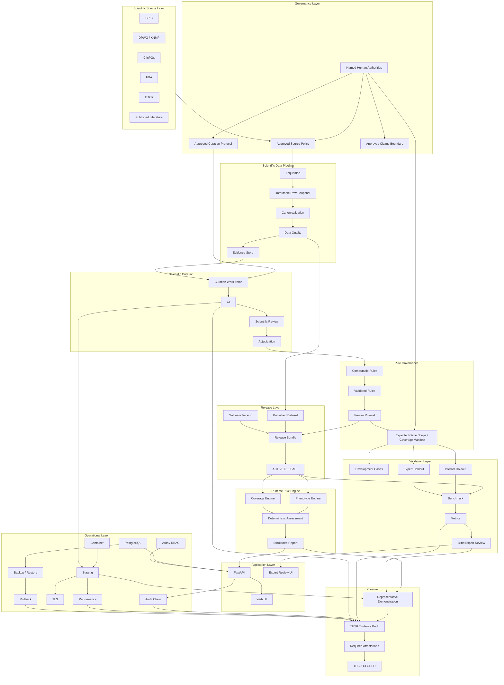
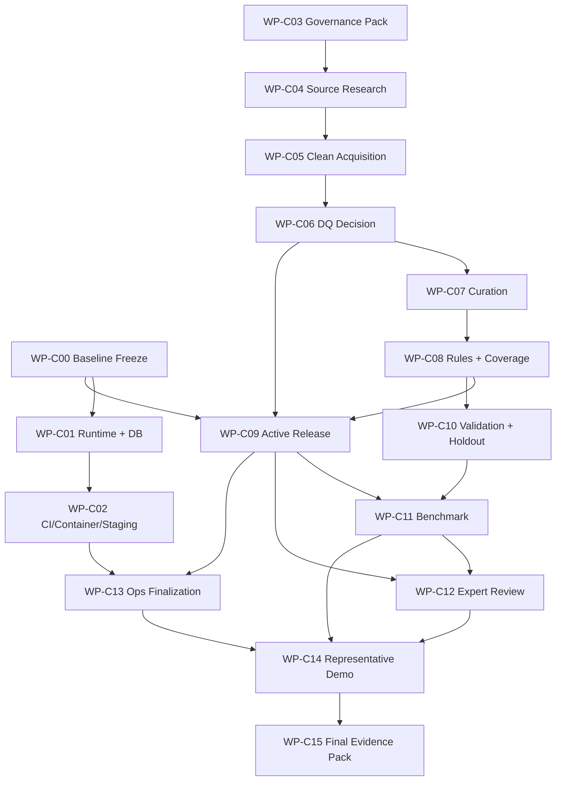

# PGx Platform V2 — Final THS-6 Closure Architecture & Work Packages

**Purpose:** Close the existing PGx Platform V2 as a defensible THS-6 prototype.  
**Mode:** Closure / execution phase. No unnecessary feature expansion.  
**Core principle:** The software platform already exists; the remaining work is to feed it governed scientific content, execute validation, collect expert evidence, and prove the system in a representative operational environment.

---

# 1. Mission

The goal of this phase is to move the project from:

```text
ENGINEERING-COMPLETE
SCIENTIFICALLY-EMPTY
OPERATIONALLY-UNEXECUTED
THS6-BLOCKED
```

to:

```text
SCIENTIFICALLY-GOVERNED
VALIDATED
EXPERT-REVIEWED
OPERATIONALLY-EXECUTED
AUDITABLE
RELEASED
THS6-DEFENSIBLE
```

This is not a redesign phase.

This is not a feature-expansion phase.

This is the final closure phase for the current THS-6 objective.

---

# 2. Final Completion Definition

The project is considered closed for the THS-6 objective only when:

```text
Gate A = PASS
Gate B = PASS
Gate C = PASS
Gate D = PASS
Gate E = PASS
Gate F = PASS

Definition of Done = 15 / 15

Representative workflow = EXECUTED

Validated release = ACTIVE

Scientific sources = APPROVED

Dataset = SEALED + APPROVED

Ruleset = FROZEN + EXECUTABLE

Validation benchmark = EXECUTED

Expert review = COMPLETED

Operational evidence = RECORDED

Required attestations = COMPLETE

ths6_achieved = true
release_may_proceed = true
```

---

# 3. Closure Execution Model

Cowork acts as the **closure orchestrator**.

Its responsibility is to:

```text
inspect
→ research
→ implement
→ execute
→ validate
→ collect evidence
→ detect blockers
→ prepare human review
→ resume after approval
→ run downstream workflows
→ rebuild the THS6 evidence pack
```

Cowork must not stop at producing TODO documents.

When a task is executable by the agent, it should be executed.

When a task requires human or external authority, Cowork must:

1. prepare everything before the checkpoint,
2. create the exact review/decision package,
3. identify the exact human action required,
4. pause only that dependency,
5. continue all unrelated work in parallel.

---

# 4. Authority Classes

## CLASS A — Autonomous Agent Work

Cowork can complete these fully:

- code changes required by an existing blocker,
- migrations,
- tests,
- public-source research,
- scientific-source metadata collection,
- dataset acquisition,
- normalization,
- evidence extraction,
- proposed curation,
- proposed computable-rule generation,
- candidate validation-case generation,
- benchmark execution,
- metric calculation,
- CI/deployment execution,
- Docker image build,
- TLS verification,
- backup/restore drills,
- rollback drills,
- performance testing,
- artifact generation,
- evidence-pack rebuilding.

## CLASS B — External Access Required

Cowork can execute after access is provided:

- GitHub / Git remote,
- PostgreSQL server,
- package registry,
- container runtime,
- staging host,
- domain / DNS,
- TLS / certificate infrastructure,
- cloud credentials,
- CI provider.

Cowork should report:

```text
BLOCKED_BY_EXTERNAL_ACCESS

Required:
...

Why:
...

Exact credential/action needed:
...
```

and continue unrelated tracks.

## CLASS C — Human Authority Required

Cowork prepares the decision package but must not impersonate the human authority.

Examples:

- scientific source approval,
- curation protocol approval,
- claims-boundary approval,
- scientific curation decisions,
- expected-gene-scope declaration,
- validation reference judgment,
- blind expert review,
- final attestations.

---

# 5. Master Architecture



---

# 6. Track Model

The closure phase runs across five tracks.

## Track A — Foundation & Operations
Git, DB, migrations, runtime, CI, Docker, staging, TLS, backup/restore, rollback, security, performance.

## Track B — Governance
Source policy, curation protocol, claims boundary, named authorities.

## Track C — Scientific Content
Source acquisition, clean dataset, evidence, curation, validated rules, coverage scope.

## Track D — Validation
Validation cases, internal holdout, expert holdout, benchmark, metrics.

## Track E — Expert / Final Closure
Blind expert review, representative demo, final evidence pack, attestations.

---

# 7. First Validated Release Scope

The first THS-6 release should remain deliberately small.

## Genes

```text
CYP2C19
CYP2D6
```

## Drugs

```text
clopidogrel
codeine
omeprazole
amitriptyline
```

## Gene–Drug Axes

```text
CYP2C19 × clopidogrel
CYP2C19 × omeprazole
CYP2C19 × amitriptyline
CYP2D6 × codeine
CYP2D6 × amitriptyline
```

## Phenotypes

```text
POOR
INTERMEDIATE
NORMAL
RAPID
ULTRARAPID
```

## Target Validated Rules

```text
~20–25 rules
```

## Scientific Sources

Minimum:

```text
CPIC
DPWG
ClinPGx
```

Preferred defensible release:

```text
CPIC
DPWG
ClinPGx
FDA
TITCK
```

## Validation Target

```text
50+ validation cases
≥20 INTERNAL_HOLDOUT
≥10 EXPERT_HOLDOUT
```

---

# 8. Final Closure Work Packages

---

## WP-C00 — Baseline Freeze & Project Identity

**Track:** A — Foundation & Operations  
**Execution class:** A / B  
**Priority:** Immediate  
**Dependencies:** None

### Objective

Create a trustworthy software identity and freeze the starting point for all downstream closure evidence.

### Scope

- create the first real Git commit,
- configure Git identity,
- add remote if available,
- create initial tag/version,
- record repository status,
- resolve or explicitly classify the 33 unlinked legacy rule candidates,
- reconcile stale WP-17 status artifacts,
- capture a closure baseline manifest.

### Deliverables

- initial commit hash,
- first software version/tag,
- baseline manifest,
- repository-cleanliness report,
- disposition report for the 33 legacy candidates,
- corrected stale gate metadata.

### Acceptance Criteria

- software version can be referenced by a release bundle,
- no unknown repository baseline remains,
- all 33 candidates are either linked or dismissed with reason,
- baseline artifacts are hashed.

### THS Contribution

Removes unnecessary software-version blockers from release activation.

---

## WP-C01 — Runtime & Database Closure

**Track:** A  
**Execution class:** A / B  
**Dependencies:** WP-C00

### Objective

Execute the existing platform against real runtime infrastructure rather than fixtures/configuration only.

### Scope

- provision PostgreSQL,
- execute all migrations through latest revision,
- verify schema,
- create dependency lockfile,
- install required runtime extras,
- execute ASGI runtime verification,
- verify real API startup,
- verify web runtime,
- verify transaction paths,
- verify audit chain against real DB.

### Deliverables

- `uv.lock`,
- DB migration execution log,
- schema verification artifact,
- ASGI runtime verification artifact,
- API health/smoke evidence,
- audit-chain verification artifact.

### Acceptance Criteria

- latest migration executed successfully,
- API starts in a real runtime,
- committed OpenAPI and served OpenAPI match,
- application reaches real PostgreSQL,
- audit events persist and verify.

### THS Contribution

Converts major platform capabilities from `IMPLEMENTED_NOT_EXECUTED` to executed operational evidence.

---

## WP-C02 — CI, Container, Staging & Reliability Closure

**Track:** A  
**Execution class:** A / B  
**Dependencies:** WP-C00, WP-C01

### Objective

Prove that the platform can be reproducibly built, deployed, secured, restored, and rolled back.

### Scope

- resolve CI action pins,
- execute CI provider workflows,
- build package distributions,
- build container image,
- deploy staging,
- verify TLS,
- run secret scan,
- generate SBOM,
- run vulnerability scan,
- perform backup/restore drill,
- perform rollback drill between two valid images/releases where possible,
- prepare performance-run infrastructure.

### Deliverables

- green CI run,
- built wheel/sdist,
- container image digest,
- staging deployment record,
- TLS evidence,
- SBOM,
- vulnerability report + disposition,
- backup/restore evidence,
- rollback evidence.

### Acceptance Criteria

- required operational gates have execution artifacts,
- deployment is reproducible,
- backup and restore satisfy defined conditions,
- rollback is demonstrated,
- staging is reachable through TLS.

### THS Contribution

Closes major Gate E operational requirements.

---

## WP-C03 — Governance Review Pack & Approval Launch

**Track:** B — Governance  
**Execution class:** A preparation + C decision  
**Dependencies:** None

### Objective

Prepare and launch the three highest-leverage human approvals in parallel.

### Human Decisions

1. Scientific Source Policy Approval
2. Curation Protocol Approval
3. Claims Boundary Approval

### Cowork Responsibilities

For each approval, create:

```text
review-package/
├── source-document.md
├── executive-summary.md
├── open-questions.md
├── identified-risks.md
├── proposed-decision.md
├── evidence-index.md
└── approval-form.md
```

### Acceptance Criteria

Cowork side:

- all three review packages complete,
- no missing prerequisite remains,
- exact reviewer role identified.

Human side:

- each item receives APPROVE / REVISE / REJECT,
- approval metadata recorded by a named person.

### THS Contribution

Unblocks the entire governed scientific chain.

---

## WP-C04 — Scientific Source Research & Approval Support

**Track:** B / C  
**Execution class:** A preparation + C approval  
**Dependencies:** WP-C03 source-policy review may run in parallel

### Objective

Collect authoritative source metadata and scientific content required for the first validated release.

### Scope

Primary target sources:

- CPIC,
- DPWG / KNMP,
- ClinPGx,
- FDA,
- TITCK.

For each source collect:

- canonical source identifier,
- organization,
- source role,
- URL / API / publication location,
- guideline or content version,
- access date,
- licence / terms,
- citation requirements,
- redistribution constraints,
- acquisition mode,
- supported PGx axes,
- evidence type,
- source-policy compatibility.

### Deliverables

- completed source registry candidates,
- licence/terms evidence,
- version identifiers,
- acquisition plan per source,
- approval-ready source packets.

### Acceptance Criteria

- minimum 3 sources approved,
- preferred 5 sources approved,
- each approved source has a known version and acquisition method,
- source-policy content hash can be generated.

### THS Contribution

Closes the scientific-source root blocker and enables clean acquisition.

---

## WP-C05 — Clean Scientific Acquisition & Sealed Dataset

**Track:** C — Scientific Content  
**Execution class:** A / B  
**Dependencies:** Approved sources from WP-C04

### Objective

Create the first legitimate V2 dataset from a new acquisition run.

### Scope

- create a new dataset ID,
- perform real source acquisition,
- store immutable raw artifacts,
- calculate checksums,
- seal snapshot,
- canonicalize drugs/genes,
- deduplicate,
- resolve entities,
- produce DQ report,
- build production-eligible evidence.

### Important Rule

Do **not** promote the quarantined legacy dataset.

A new dataset identifier is mandatory.

### Deliverables

- new dataset ID,
- SEALED snapshot,
- raw manifest,
- checksums,
- canonical dataset,
- DQ report,
- evidence build,
- source-to-evidence traceability.

### Acceptance Criteria

- snapshot state = SEALED,
- canonical build is reproducible,
- all in-scope entities resolve,
- DQ output contains no unhandled blocking issue,
- evidence is no longer inherited from quarantined legacy content.

### THS Contribution

Creates the first scientifically legitimate dataset chain.

---

## WP-C06 — Dataset Quality Decision Mechanism & Publication

**Track:** C  
**Execution class:** A implementation + C decision  
**Dependencies:** WP-C05

### Objective

Close the known gap where the system can generate a DQ report but cannot record the named human quality decision.

### Scope

Implement a governed `DatasetQualityDecision` mechanism.

Suggested fields:

```text
dataset_id
reviewer_id
decision
rationale
reviewed_at
dq_artifact_hash
source_policy_hash
```

### Cowork Responsibilities

- implement the missing mechanism,
- add tests,
- wire it to dataset lifecycle,
- prepare quality-review packet.

### Human Responsibility

The data owner reviews the DQ report and records:

```text
APPROVED
or
REJECTED
```

### Deliverables

- dataset-quality decision schema/model/service,
- tests,
- review artifact,
- final published/approved dataset state.

### Acceptance Criteria

- named data owner can record a decision,
- decision is immutable/audited,
- approved dataset becomes release-eligible.

### THS Contribution

Closes Gate A dataset publication/quality blocker.

---

## WP-C07 — Scientific Curation Closure

**Track:** C  
**Execution class:** A preparation + C scientific judgment  
**Dependencies:** Approved curation protocol + approved evidence build

### Objective

Produce the first governed curated interpretations for the minimal release scope.

### Scope

Only curate the five first-release axes.

Cowork prepares:

- evidence bundles,
- side-by-side source comparisons,
- proposed normalized interpretations,
- effect direction,
- clinical significance,
- metabolism/exposure/activation direction,
- rationale,
- conflict flags,
- evidence references.

### Human Workflow

```text
Evidence bundle
↓
Curator A decision
↓
Curator B decision
↓
Agreement?
  YES → accepted
  NO  → adjudicator
↓
Approved CuratedInterpretation
```

### Deliverables

- curation work items,
- curator assignments,
- completed inter-curator exercise,
- curated interpretations,
- adjudications where needed,
- provenance records.

### Acceptance Criteria

- two named curators participate,
- disagreements are adjudicated,
- every interpretation has rationale and evidence refs,
- no legacy manual risk hint becomes a validated interpretation automatically.

### THS Contribution

Creates the first human-reviewed scientific layer.

---

## WP-C08 — Expected Gene Scope, Validated Rules & Frozen Ruleset

**Track:** C  
**Execution class:** A preparation + C declaration/approval  
**Dependencies:** WP-C07

### Objective

Transform curated interpretations into deterministic, governed executable rules.

### Scope

- generate proposed computable rules,
- validate schema and provenance,
- obtain rule approval envelopes,
- declare expected gene scope per drug,
- build coverage manifest,
- validate rule lifecycle,
- build ruleset,
- freeze ruleset,
- register executable ruleset.

### Required Human Input

A named scientific authority must declare expected gene scope for each in-scope drug.

Cowork may suggest the scope but may not self-approve it.

### Deliverables

- ~20–25 validated rules,
- rule provenance,
- approval envelopes,
- expected-gene-scope declarations,
- coverage manifest,
- frozen executable ruleset.

### Acceptance Criteria

- no unvalidated rule executes,
- every rule has evidence references and full provenance,
- expected scope exists for every in-scope drug,
- ruleset status = FROZEN,
- registry marks ruleset executable.

### THS Contribution

Closes Gate B and enables governed assessment.

---

## WP-C09 — First Active Governed Release

**Track:** C / A convergence  
**Execution class:** A  
**Dependencies:** WP-C00, WP-C06, WP-C08

### Objective

Activate the first real governed release.

### Release Bundle

```text
Software Version
+
Approved Dataset
+
Frozen Ruleset
=
ReleaseBundle
```

### Scope

- register software version,
- register approved dataset,
- register frozen ruleset,
- create release manifest,
- run release validation,
- activate release,
- verify rollback metadata.

### Deliverables

- release manifest,
- release ID,
- active-release record,
- release integrity report.

### Acceptance Criteria

- release status = ACTIVE,
- assessment service can resolve active dataset/ruleset/software,
- all assessments include release metadata,
- no legacy mutable data path can bypass the release.

### THS Contribution

First point where the new architecture can perform a real governed assessment.

---

## WP-C10 — Validation Dataset & Holdout Closure

**Track:** D — Validation  
**Execution class:** A preparation + C validation ownership  
**Dependencies:** Scope declaration; can begin before WP-C09 finishes

### Objective

Build serious independent validation evidence.

### Target

```text
50+ validation cases
≥20 INTERNAL_HOLDOUT
≥10 EXPERT_HOLDOUT
```

### Allowed Case Types

```text
SYNTHETIC
PUBLISHED_LITERATURE_DERIVED
```

No real-patient / raw-genomic cases in P0.

### Cowork Responsibilities

- search published literature,
- create candidate case records,
- fill provenance,
- create expected-answer drafts,
- fingerprint cases,
- enforce development/holdout separation,
- create access ledger,
- detect leakage.

### Human Responsibilities

Validation owner:

- approves case seriousness,
- approves representativeness,
- approves reference judgment,
- assigns holdout role.

### Deliverables

- validation catalogue,
- internal holdout set,
- expert holdout set,
- separation audit,
- provenance records.

### Acceptance Criteria

- development cases never count as validation evidence,
- no holdout leakage,
- every validation case has approved reference judgment,
- minimum counts satisfied.

### THS Contribution

Closes major Gate D data requirements.

---

## WP-C11 — Benchmark & Metrics Execution

**Track:** D  
**Execution class:** A  
**Dependencies:** WP-C09 + WP-C10

### Objective

Run the first real benchmark against the active governed release.

### Flow

```text
Validation cases
↓
Active release
↓
Assessment execution
↓
Reference-vs-actual comparison
↓
Metric engine
↓
Validation report
```

### Metrics

At minimum:

- attention agreement,
- coverage agreement,
- phenotype handling,
- NOT_ASSESSED correctness,
- unsafe false reassurance count,
- evidence traceability,
- source-conflict handling,
- deterministic repeatability,
- system failure rate.

### Deliverables

- benchmark execution artifact,
- per-case result table,
- metric values,
- thresholds,
- disagreement list,
- validation report.

### Acceptance Criteria

- metrics contain real values, not null placeholders,
- thresholds are declared,
- failures are classified,
- unsafe false reassurance target is satisfied or explicitly blocks release.

### THS Contribution

Converts validation infrastructure into executed scientific evidence.

---

## WP-C12 — Blind Expert Review

**Track:** E — Expert Closure  
**Execution class:** A workflow + C expert judgment  
**Dependencies:** WP-C03 protocol approval, WP-C09, WP-C10, WP-C11

### Objective

Execute the existing blind-first expert-review workflow with real named experts.

### Workflow

```text
Expert Holdout Case
↓
Expert sees case input only
↓
Expert enters independent judgment
↓
Judgment locked
↓
System result revealed
↓
Agreement / disagreement
↓
Expert quality scoring
↓
Review finalized
```

### Cowork Responsibilities

- prepare reviewer accounts,
- assign cases,
- manage reveal protocol,
- verify locks,
- collect review metadata,
- calculate agreement,
- generate disagreement report.

### Human Responsibilities

Experts provide:

- independent reference judgment,
- agreement/disagreement,
- explanation-quality assessment,
- misleading-language assessment,
- comments.

### Deliverables

- completed expert reviews,
- blind-review audit trail,
- agreement metrics,
- expert-review report.

### Acceptance Criteria

- named reviewers exist,
- blind-first ordering is verified,
- required expert holdout count completed,
- no AI-generated expert judgment is recorded as human evidence.

### THS Contribution

Closes one of the most important human-evidence requirements for THS 6.

---

## WP-C13 — Performance, Security & Operational Evidence Finalization

**Track:** A / E  
**Execution class:** A / B  
**Dependencies:** WP-C09 + staging from WP-C02

### Objective

Execute all remaining operational checks against a real active release.

### Scope

- 1,000-assessment performance run,
- p50/p95 latency,
- error rate,
- resource behavior,
- security gate,
- audit-chain verification,
- SBOM validation,
- vulnerability disposition,
- backup/restore recheck if needed,
- rollback recheck if needed.

### Deliverables

- performance report,
- operational reliability report,
- final security gate result,
- final deployment evidence.

### Acceptance Criteria

- no placeholder/null operational evidence remains,
- required release gates pass or have explicit blocking disposition,
- runtime evidence references active release ID.

### THS Contribution

Final Gate E closure.

---

## WP-C14 — Representative THS-6 Demonstration

**Track:** E  
**Execution class:** A + human participant  
**Dependencies:** WP-C09, WP-C11, WP-C12, WP-C13

### Objective

Execute and record the representative end-to-end workflow in a production-like environment.

### Demo Configuration

```text
ACTIVE validated release
LLM OFF
P1 features OFF
No uncontrolled network dependency
Real PostgreSQL
Deployed web/API
Audit enabled
```

### Demonstration Flow

1. Expert logs in.
2. Validation/literature-derived case selected.
3. CYP phenotype profile shown.
4. Medication list shown.
5. Assessment executed.
6. Attention findings shown.
7. Coverage shown separately.
8. Evidence opened.
9. Rule provenance/version opened.
10. Structured deterministic report generated.
11. Expert-review flow shown.
12. Audit event inspected.
13. Validation metrics shown.
14. Release metadata shown.
15. THS-6 evidence dashboard shown.

### Deliverables

- demo run artifact,
- timestamps,
- logs,
- screenshots/captures where appropriate,
- audit events,
- release manifest reference,
- final workflow result.

### Acceptance Criteria

- entire representative workflow executes without hidden manual intervention,
- findings are traceable,
- missing-data behavior is visible,
- active release metadata is shown,
- audit trail is complete.

### THS Contribution

Direct representative-environment demonstration required for defensible THS 6.

---

## WP-C15 — Final THS-6 Evidence Pack, Gates & Attestations

**Track:** E — Final Closure  
**Execution class:** A packaging + C attestations  
**Dependencies:** All previous closure WPs

### Objective

Rebuild the final THS-6 evidence package and close every gate.

### Evidence Model

```text
Claim
↓
Artifact
↓
Execution
↓
Hash
↓
Owner
↓
Timestamp
```

### Pack Sections

- Scientific Source Pack
- Dataset Pack
- Data Quality Pack
- Curation Pack
- Rule Pack
- Coverage Pack
- Release Pack
- Validation Pack
- Expert Review Pack
- Security Pack
- Deployment Pack
- Performance Pack
- Representative Demo Pack

### Required Final Checks

```text
Gate A = PASS
Gate B = PASS
Gate C = PASS
Gate D = PASS
Gate E = PASS
Gate F = PASS

Definition of Done = 15/15
```

### Human Attestations

The required named roles review their evidence and sign.

Cowork must prepare each attestation packet, but cannot generate the human signature.

### Deliverables

- rebuilt evidence pack,
- gate report,
- DoD report,
- attestation packets,
- final release decision artifact,
- final THS-6 summary.

### Acceptance Criteria

```text
ths6_achieved = true
release_may_proceed = true
```

with all evidence resolving successfully.

### THS Contribution

Final closure.

---

# 9. Dependency Graph



---

# 10. Parallel Execution Strategy

Start immediately in parallel:

## Lane 1 — Operations

```text
WP-C00
→ WP-C01
→ WP-C02
```

## Lane 2 — Governance & Science

```text
WP-C03
→ WP-C04
→ WP-C05
→ WP-C06
→ WP-C07
→ WP-C08
→ WP-C09
```

## Lane 3 — Validation

As soon as scope is stable:

```text
WP-C10
```

Then converges:

```text
WP-C09 + WP-C10
→ WP-C11
→ WP-C12
```

Operations converges separately:

```text
WP-C02 + WP-C09
→ WP-C13
```

Final convergence:

```text
WP-C11
+
WP-C12
+
WP-C13
→ WP-C14
→ WP-C15
→ THS 6
```

---

# 11. Cowork Execution Policy

Cowork must obey these rules during the closure phase:

1. Do not create new scope unless required by an existing blocker.
2. Do not reimplement working architecture.
3. Prefer execution over documentation.
4. Every completion claim must have executable evidence.
5. Never convert legacy scientific opinion into validated scientific content automatically.
6. Never treat missing evidence as a conclusion.
7. Never impersonate a curator, physician, reviewer, approver, or signatory.
8. When blocked by human review, prepare the review pack and continue parallel work.
9. When blocked by infrastructure, identify the exact external action required and continue parallel work.
10. Every artifact must be versioned and traceable.
11. Development cases must never be relabeled as holdout/validation evidence.
12. Do not promote the quarantined legacy dataset.
13. Do not enable P1/P2 features to make the demo look richer before P0 closure.
14. Do not mark THS-6 achieved until all gates and DoD items genuinely pass.

---

# 12. Human Checkpoint Format

Cowork should never simply output:

```text
Waiting for human.
```

Instead, every human checkpoint should become a package like:

```text
HUMAN_CHECKPOINT_HXX/
├── README.md
├── decision-context.md
├── evidence-table.csv
├── proposed-decisions.csv
├── unresolved-questions.md
├── risk-summary.md
└── approval-form.md
```

The objective is to reduce real human participation to focused review and decision-making, not manual information gathering.

---

# 13. Out of Scope Until THS-6 Closure

Do not spend closure time on:

- wide knowledge-graph expansion,
- candidate scoring,
- full phenoconversion,
- full multi-drug engine,
- VCF ingestion,
- EHR integration,
- real patient-data pipeline,
- clinical treatment recommendation,
- dose recommendation,
- major LLM feature work,
- target/pathway expansion,
- adverse-effect prediction.

These belong to later THS-7 / productization phases.

---

# 14. Critical Path

The true critical chain is:

```text
source approval
↓
new acquisition
↓
sealed dataset
↓
DQ approval
↓
evidence
↓
curation
↓
rule validation
↓
frozen ruleset
↓
active release
↓
benchmark
↓
blind expert review
↓
representative demo
↓
final evidence pack
↓
attestations
↓
THS 6
```

The project should optimize for shortening this chain, mainly by keeping the first validated scientific scope small.

---

# 15. Final Repository State

At closure, the repository should contain:

```text
software/
    tagged software version

data/
    approved sealed dataset

evidence/
    production-eligible evidence

curation/
    approved interpretations

rules/
    validated rules
    frozen ruleset

release/
    active release

validation/
    development cases
    internal holdout
    expert holdout
    benchmark results
    metric reports

expert-review/
    completed reviews

operations/
    CI evidence
    staging evidence
    TLS evidence
    backup/restore evidence
    rollback evidence
    performance evidence
    SBOM/security evidence

ths6/
    final evidence pack
    gate results
    Definition of Done
    attestations
```

Final state:

```text
the machine is built
the scientific content is governed
the release is active
the validation has been executed
the experts have reviewed it
the operational environment has been demonstrated
the evidence is traceable

THS6 = ACHIEVED
```

---

# 16. Work Package Index

| WP | Name | Main Track | Human Gate? |
|---|---|---|---|
| WP-C00 | Baseline Freeze & Project Identity | Operations | No |
| WP-C01 | Runtime & Database Closure | Operations | No |
| WP-C02 | CI, Container, Staging & Reliability Closure | Operations | External access |
| WP-C03 | Governance Review Pack & Approval Launch | Governance | Yes |
| WP-C04 | Scientific Source Research & Approval Support | Governance/Science | Yes |
| WP-C05 | Clean Scientific Acquisition & Sealed Dataset | Science | No |
| WP-C06 | Dataset Quality Decision Mechanism & Publication | Science | Yes |
| WP-C07 | Scientific Curation Closure | Science | Yes |
| WP-C08 | Expected Gene Scope, Validated Rules & Frozen Ruleset | Science | Yes |
| WP-C09 | First Active Governed Release | Release | No |
| WP-C10 | Validation Dataset & Holdout Closure | Validation | Yes |
| WP-C11 | Benchmark & Metrics Execution | Validation | No |
| WP-C12 | Blind Expert Review | Expert | Yes |
| WP-C13 | Performance, Security & Operational Evidence Finalization | Operations | External access |
| WP-C14 | Representative THS-6 Demonstration | Final Demo | Human participant |
| WP-C15 | Final THS-6 Evidence Pack, Gates & Attestations | Closure | Yes |

---

# 17. Recommended Immediate Start

Run these three work packages in parallel:

```text
WP-C00 — Baseline Freeze & Project Identity
WP-C03 — Governance Review Pack & Approval Launch
WP-C04 — Scientific Source Research & Approval Support
```

Then start `WP-C01` immediately after `WP-C00`.

Once governance/source decisions are available, continue through:

```text
WP-C05
→ WP-C06
→ WP-C07
→ WP-C08
→ WP-C09
```

In parallel, start validation preparation:

```text
WP-C10
```

Final closure sequence:

```text
WP-C09 + WP-C10
→ WP-C11
→ WP-C12

WP-C02 + WP-C09
→ WP-C13

WP-C11 + WP-C12 + WP-C13
→ WP-C14
→ WP-C15
→ THS 6
```
