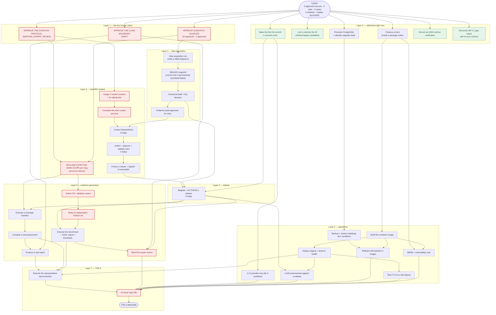

# THS 6 Dependency Map

> **Historical audit notice:** This document preserves the dependency graph measured on 2026-09-05 under the original intermediate-human-gate policy. It is not the current execution sequence. For current candidate-first sequencing, see `docs/closure/current-execution-policy.md`, `docs/closure/remaining-execution-waves.md`, and `PGx_Platform_V2_Final_THS6_Closure_Architecture_WPs.md`. The historical statements below have intentionally not been rewritten as if the new policy existed at audit time.

**Audit type:** read-only dependency reconstruction
**Audit date:** 2026-09-05 (UTC)
**Scope note:** this file deliberately contains **no work packages**. It
describes only what depends on what, so a second planning phase can cut the
work correctly.

---

## 1. The dependency graph, as the repository enforces it



---

## 2. Strict sequential dependencies

These cannot be parallelised. Each is enforced by a schema, a lifecycle enum
or a required provenance field — not by convention.

```
source approval
  └→ acquisition run              (an unapproved source may not be acquired)
      └→ SEALED snapshot          (no transition out of QUARANTINED — new id required)
          └→ canonical build + DQ decision
              └→ evidence build approved for rules
                  └→ curated interpretation
                      └→ rule approval envelope
                          └→ validated rule
                              └→ frozen ruleset
                                  └→ ACTIVE release
                                      └→ real assessment
                                          └→ real report

protocol approval
  └→ curator assignment
      └→ inter-curator exercise
          └→ curated interpretation      (joins the chain above)

expected gene scope declaration
  └→ coverage manifest
      └→ coverage execution
          └→ supported axes

validation cases + holdout set
  └→ benchmark execution           (also requires an ACTIVE release)
      └→ metric values + thresholds
          └→ validation report

git commit
  └→ CI provider run               (0 remotes, 0 commits today)
      └→ safety invariants passing in CI

lockfile
  └→ image build
      └→ staging deployment
          └→ TLS observation
              └→ performance run

database
  └→ migration executed
      └→ audit chain verified
      └→ backup executed
          └→ restore verified
```

### The three hardest sequential links

1. **`QUARANTINED → SEALED` does not exist.** `SnapshotState`'s docstring:
   *"There is no transition out of `SEALED` or `QUARANTINED`: a snapshot is
   not reopened, it is superseded by a new dataset ID."* Every plan that
   assumes the current dataset can be promoted is wrong.

2. **A rule cannot exist before three human approvals.** Rule provenance
   requires `source_policy_content_hash`, `protocol_content_hash` and
   `approval_envelope_hash`. There is no partial rule, no draft that skips
   provenance, no test-only path into `computable_rules`.

3. **Expected gene scope has no upstream source.** It cannot be derived from
   the catalogue, evidence, guideline presence, an existing rule or a legacy
   row. It is a human declaration with no input other than judgement, and
   coverage is meaningless without it.

---

## 3. What can run in parallel

Four independent tracks. Nothing in one blocks anything in another until they
converge at the release.

```
TRACK 1 — SCIENTIFIC (the critical path)
  source approval → acquisition → canonical → evidence → curation → rules → ruleset

TRACK 2 — GOVERNANCE (starts today, no prerequisites)
  claim boundary approval
  curation protocol approval          ← feeds Track 1 at the curation step
  curator assignment + exercise

TRACK 3 — VALIDATION (starts once scope is declared)
  validation case authoring
  holdout set construction
  expert reviewer recruitment + protocol signature
  → converges with Track 1 at the benchmark

TRACK 4 — OPERATIONS (fully independent of Tracks 1–3 until the release)
  git commit → CI
  database → migration → audit → backup → restore
  lockfile → image → staging → TLS → SBOM → vulnerability scan
  rollback drill
```

**Track 4 is the one most often sequenced wrongly.** Nothing in operations
needs a single scientific artifact until the performance run and the final
demo. A team could have a green CI pipeline, a deployed staging environment
with real TLS, a verified restore and a rollback drill **before the first
source is approved** — and should, because those are the items whose
lead times are procurement rather than judgement.

### Parallelism inside Track 2

The three governance approvals are mutually independent:

- claim boundary approval needs nothing;
- protocol approval needs nothing;
- source approval needs nothing.

All three can be requested on the same day, from three different people.
**That is the single highest-leverage scheduling decision available.**

---

## 4. The critical path

Longest chain of strictly sequential, non-parallelisable work:

```
source approval
  → acquisition run
    → sealed snapshot
      → canonical build + DQ decision
        → evidence build approved for rules
          → [joins protocol approval + curator assignment + exercise]
            → curated interpretations
              → rule approval + validation
                → frozen ruleset
                  → ACTIVE release
                    → coverage execution + real assessment + real report
                      → benchmark execution (needs cases + holdout, authored in parallel)
                        → blind-first expert review
                          → representative demonstration
                            → 9 sign-offs
                              → THS 6
```

**16 sequential steps. Eleven of them are gated on a named human.**

The path is dominated by two clusters:

- **Cluster 1 — curation** (`interpretations → rules → ruleset`). Two named
  curators, an adjudicator and a protocol. This is the longest wall-clock
  item and it cannot be shortened by adding engineers.
- **Cluster 2 — validation and review** (`cases → holdout → benchmark →
  expert review`). Bounded by expert availability and by the requirement that
  the holdout set be built by someone not developing the rules.

**Shortening the path.** The only legitimate lever is scope: fewer
gene–drug axes means fewer interpretations, fewer rules and fewer cases.
That is exactly why `THS6_DATA_REQUIREMENTS.md` §4 recommends 2 genes and
4 drugs rather than 5 and 11.

---

## 5. Blockers by kind

### 5.1 External blockers — nothing in the repository can clear these

| Blocker | Blocks | Notes |
|---|---|---|
| No network egress to source publishers | acquisition, licence retrieval | 17 of 20 sources have `acquisition_mode: NOT_DETERMINED`; all 17 evidence entries are `NOT_OBTAINED` |
| No package index reachable | `uv.lock`, image build, SBOM, argon2 install | `package_index_reachable: false` |
| No PostgreSQL server | 44 tables, 11 migrations, audit, sessions, backup | `database_available: false` |
| No container runtime | image, staging, rollback | `container_runtime_available: false` |
| No CI provider + no git remote | CI execution, `SAFETY-INV-008` full enforcement | `ci_executed: null`, **0 remotes, 0 commits** |
| No staging host + no certificate authority | staging, TLS | `staging_deployed: false`, `tls_observed: false` |
| Source licence terms | every source approval | Each publisher's terms must be retrieved and read |

### 5.2 Human blockers — no engineering closes these

| Blocker | Owner | Blocks | Prerequisites |
|---|---|---|---|
| 0 of 20 sources approved | scientific source approver | **the entire scientific chain** | none |
| Curation protocol unapproved | domain expert | curation, and every rule's `protocol_content_hash` | none |
| Claim boundary is a draft | clinical safety authority | reports, expert review, release | none |
| 0 curators assigned, exercise not run | curation lead | interpretations | protocol approval |
| Expected gene scope undeclared | scientific declarant | coverage, P0-DOD-004 | protocol + sources |
| No dataset quality decision — **and no mechanism to record one** | data owner | dataset publication | sealed snapshot |
| 0 validation cases, 0 holdout | validation owner | Gate D, benchmark | scope declaration |
| 0 protocol signatories, 0 named reviewers | expert review chair | Gate D, release | protocol, release, cases |
| 0 of 9 sign-offs | all nine roles | THS 6 itself | everything |

### 5.3 Data blockers — consequences of the above, not independent

| Blocker | Root cause |
|---|---|
| Snapshot permanently quarantined | no approved source → no legitimate acquisition run |
| 0 curated interpretations | protocol unapproved + no curators |
| 0 validated rules | no interpretations |
| 0 executable rulesets | no validated rules |
| 0 active releases | no frozen ruleset + no published dataset |
| 0 assessments / 0 reports | no active release |
| 0 coverage executions | no declared expected scope + no ruleset |
| 0 computed metrics | no benchmark → no active release |
| 33 unlinked legacy candidates | **independent** — clearable today |

---

## 6. Convergence points

Four places where independent tracks must meet. These are the natural
synchronisation points for a plan.

| # | Convergence | Requires | Produces |
|---|---|---|---|
| **C1** | Curation can begin | approved protocol **and** approved evidence build **and** 2 assigned curators | first curated interpretation |
| **C2** | A release can be activated | frozen ruleset **and** published dataset **and** a software version (a commit) | `ACTIVE` release |
| **C3** | Validation can be measured | active release **and** ≥50 cases **and** a holdout set **and** reference judgments | computed metric values |
| **C4** | THS 6 can be claimed | all six gates PASS **and** 15/15 DoD **and** an executed demonstration **and** 9 signatures | `ths6_achieved: true` |

**C2 is the one to watch.** It needs a Git commit (for the software version
identity) as much as it needs a frozen ruleset — and the commit is free
today while the ruleset is months of human work. There is no reason for the
commit to be on the critical path, and today it is.

---

## 7. Sequencing recommendation

Not a plan — an ordering constraint that any plan should respect.

**Do first, today, in parallel, because they cost nothing and unblock the
most:**

1. Request the three governance approvals (source, protocol, claim boundary)
   from three different people simultaneously.
2. Make the first Git commit.
3. Start Track 4 (operations) end to end — it needs no science.

**Do not do:**

- Do not author validation cases before expected gene scope is declared;
  you will write cases for axes nobody has agreed are in scope.
- Do not attempt to promote the existing quarantined dataset; the lifecycle
  forbids it and the attempt will consume time.
- Do not seed curation from the 1,559 legacy proposals to hit a count. They
  are stored under `raw_*` field names specifically so that reading them is
  obviously reading the old prototype's unreviewed opinion.
- Do not treat the 7 development cases as validation evidence. They are
  contractually excluded, and the separation audit's current pass over them
  is a check with nothing to separate them from.
