# PGx Platform V2 - Repository Architecture and WP Execution Contract

Status: Proposed target architecture  
Plan source: `TEKNOFEST PGx Platform V2 - Refactored THS 6 Master Development Plan`, version 1.0, 25 August 2026  
Repository baseline date: 29 August 2026  
Target: A traceable, deterministic, independently validated, representative THS 6 prototype

## 1. Purpose of this document

This document is the implementation source of truth for migrating the current script-based PGx MVP into the V2 modular-monolith architecture described by work packages WP-00 through WP-25.

It is written so that one work package can be handed to an AI coding agent without requiring that agent to redesign the system. Each WP section defines its repository context, files, boundaries, migration behavior, tests, acceptance criteria, and THS 6 evidence.

This document does not itself approve scientific claims, rules, source licenses, or THS status. Items marked as an R&D or Expert Gate require an explicit human decision and a recorded approval artifact. An AI coding agent may implement workflow and validation mechanics, but must not fabricate scientific approval, expert review, source permissions, holdout results, or clinical evidence.

## 2. Non-negotiable product boundary

### 2.1 Intended purpose

PGx Platform V2 is a research/prototype decision-support system that evaluates a synthetic or protocol-defined CYP phenotype profile and medication list against a versioned, expert-governed pharmacogenetic ruleset. It produces deterministic, evidence-linked attention findings and a separate coverage assessment.

The system is designed to demonstrate traceable pharmacogenetic assessment. It is not a clinical decision-maker.

### 2.2 Prohibited claims and actions

The system must not:

- diagnose a condition;
- prescribe, stop, replace, or select a medication;
- calculate or recommend a dose;
- declare a drug, phenotype, combination, or candidate safe;
- describe a candidate as safer, preferred, suitable, or clinically equivalent;
- infer a real patient's phenotype from a VCF, genotype, diplotype, or laboratory report in P0;
- treat missing evidence as low risk or no risk;
- allow an LLM to modify a calculated finding, coverage status, evidence reference, or version identifier;
- present development/demo cases as independent validation evidence;
- present rule-row counts as independent clinical evidence counts.

### 2.3 Operating modes

| Mode | Allowed input | Intended use | Persistence | Claim language |
|---|---|---|---|---|
| `DEMO` | Synthetic cases and public demo profiles | Jury demonstration and training | May persist | Research/prototype only |
| `VALIDATION` | Versioned development, internal holdout, or expert holdout cases | Software and scientific validation | Must persist with case role and release bundle | Validation result only |
| `PILOT` | Disabled in P0 | Future protocol-defined pilot | Not implemented | P2 gate required |

`PILOT` must remain unavailable unless intended purpose, privacy, ethics, consent, security, and validation claims are formally expanded.

## 3. Architecture safety principles

The following invariants are system requirements, not documentation suggestions:

1. Missing data must never produce `LOW` or `NO_ACTIVE_ATTENTION`.
2. Only `VALIDATED` rules from the active immutable ruleset may execute.
3. Every calculated finding must include at least one traceable evidence reference.
4. `RAPID` and `ULTRARAPID` are distinct unless a validated rule explicitly lists both.
5. Risk and coverage are separate first-class outputs.
6. Same input plus the same release bundle must produce the same structured assessment.
7. Candidate exploration must never label a candidate as safer or recommend treatment.
8. LLM output is optional, downstream, schema-checked, and unable to alter clinical facts.
9. Development/curation cases and independent holdout cases must not be mixed.
10. Dataset, ruleset, software, input, and output identities must be auditable.

## 4. Current repository baseline

### 4.1 Existing executable modules

| Legacy file | Current responsibility | V2 decision | Target owner |
|---|---|---|---|
| `clinpgx_probe.py` | First-generation OpenAPI/API exploration | `RETIRE_AFTER_BASELINE` | Kept only as historical evidence |
| `clinpgx_probe_v2.py` | Gene/drug resolution and ClinPGx retrieval | `MIGRATE` | `pgx/ingestion/clinpgx/` |
| `clean_mvp_seed_dataset.py` | Normalization, dedup, manual effect hints, demo seed build | `REPLACE_AFTER_MIGRATION` | `pgx/normalization/`, `pgx/curation/`, `pgx/rules/` |
| `risk_engine.py` | Phenotype matching, risk flags, same-gene notes, deterministic report input | `MIGRATE` | `pgx/engine/` and `pgx/application/` |
| `gemini_report_generator.py` | Optional Gemini rendering and deterministic fallback | `SPLIT_AND_MIGRATE_P1` | Deterministic part to `pgx/reporting/`; LLM part to P1 adapter |
| `candidate_onboarding.py` | Candidate chemical resolution and optional seed merge | `RESTRICT_TO_P1` | Candidate ingestion/curation workflow |
| `alternative_ranker.py` | Manual candidate comparison and 0-100 heuristic | `RETIRE_SCORE_KEEP_CONTEXT_P1` | Candidate exploration without score |

Legacy entrypoints must not be renamed or deleted before WP-01 captures reproducible snapshots. During P0 migration they remain baseline executables, not production modules.

### 4.2 Existing data and output areas

| Path | Meaning | V2 treatment |
|---|---|---|
| `clinpgx_outputs/` | V1 exploration output | Legacy snapshot only |
| `clinpgx_outputs_v2/` | Raw/intermediate ClinPGx retrieval output | Input to WP-06 snapshot migration |
| `clinpgx_mvp_seed/` | Current mutable seed, reports, candidate extensions | Legacy dataset snapshot; not an immutable V2 dataset |
| `final_report/` | Recorded Gemini report and prompt artifacts | Legacy report snapshot |
| `candidate_alternatives.csv` | Manually curated candidate lookup | P1 development seed only |
| `drug_graph_edges.csv` | CSV pseudo-graph/context | P1 migration seed only |
| `MVP_1_TEKNIK_DURUM_RAPORU.md` | Historical technical report | Evidence for legacy inventory, not current state authority |

### 4.3 Verified baseline facts

- The original cleaner deterministically rebuilds 5 genes, 11 drugs, 30 guideline rows, and 3,084 phenotype-effect rows from `clinpgx_outputs_v2/`.
- Candidate onboarding later mutated the active legacy seed to 15 drugs and 36 guideline rows.
- `mvp_seed_summary.json` still reports 11 drugs and 30 guideline rows and is stale relative to the active CSV files.
- The recorded P2 CYP2C19-poor demonstration reproduces 3 active flags: clopidogrel high, voriconazole high, and amitriptyline medium.
- Prasugrel and ticagrelor are currently recognized chemicals but have no usable phenotype-effect rule; the beta ranker reports `insufficient_pgx_rule_data`.
- There is no package manifest, automated test suite, database, API, web application, authentication, CI pipeline, or immutable release registry in the current repository.

### 4.4 Known legacy defects and migration decisions

| ID | Defect | Required V2 behavior |
|---|---|---|
| `LEGACY-BUG-001` | `RAPID` and `ULTRARAPID` implicitly match each other | Exact match by default; multi-phenotype rules must list an explicit set |
| `LEGACY-BUG-002` | Missing/no-rule/unsupported drugs receive top-level risk `none` | Risk becomes `NOT_ASSESSED`; explicit coverage and reason code are mandatory |
| `LEGACY-BUG-003` | Gemini compact payload drops `status` and missing-data reason | Structured report must preserve coverage, reason, evidence, and version metadata |
| `LEGACY-BUG-004` | Pair endpoint case variants produce large duplicate sets | Canonical dedup before rule construction; duplicates reported as DQ metrics |
| `LEGACY-BUG-005` | Pair-level guideline presence upgrades many annotation rows to `high_guideline_supported` | Evidence strength belongs to the exact evidence/interpretation, not merely the pair |
| `LEGACY-BUG-006` | `MANUAL_EFFECT_HINTS` applies pair-level effect/severity broadly | Import as unapproved draft curation proposals; never auto-validate |
| `LEGACY-BUG-007` | Summary counts become stale after seed merge | V2 artifacts are immutable; counts are generated from the artifact manifest |
| `LEGACY-BUG-008` | Candidate graph is manual lookup plus display context, not traversal | P1 must either implement traversal or call the feature a manual lookup |
| `LEGACY-BUG-009` | 0-100 candidate score creates an unsupported evaluability/safety impression | Score is removed from V2 P0/P1 |
| `LEGACY-BUG-010` | `.bak` files are overwritten on repeated merge | No in-place mutation; activate a new immutable dataset/ruleset version |
| `LEGACY-BUG-011` | Current API acquisition lacks robust pagination, retry, provenance, and failure completeness | Production adapter must record and verify a complete acquisition run |
| `LEGACY-BUG-012` | Current report can surface dosage/replacement language from source summaries | Evidence may preserve source text, but user-facing summaries must remain neutral and claim-scanned |

Known defects are not regression expectations. WP-01 snapshots them, and later WPs explicitly whitelist corrected output differences.

## 5. Target architecture

### 5.1 Architectural style

V2 is a Python modular monolith with PostgreSQL. One deployable application serves both FastAPI endpoints and a server-rendered demonstration UI. Scientific acquisition and dataset/ruleset build operations run as explicit CLI jobs, not background magic.

P0 does not require microservices, Redis, a graph database, a task queue, Kubernetes, or a separate JavaScript SPA. These may be introduced only by a later architecture decision record and must not block the critical path.

```mermaid
flowchart LR
    SRC["Scientific sources"] --> ING["Ingestion adapters"]
    ING --> RAW["Immutable raw snapshot"]
    RAW --> NORM["Canonicalization and DQ"]
    NORM --> EVID["EvidenceRecord store"]
    EVID --> CUR["Human curation workflow"]
    CUR --> RULES["Validated immutable ruleset"]
    RULES --> CORE["Phenotype + coverage + assessment engine"]
    CORE --> RESULT["AssessmentResult"]
    RESULT --> REPORT["Deterministic StructuredReport"]
    REPORT --> API["FastAPI"]
    API --> WEB["Demo and expert-review UI"]
    REPORT -. "P1, default off" .-> LLM["Safe LLM renderer"]
```



### 5.2 Dependency direction

```text
apps/api, apps/web
        |
        v
pgx/application
        |
        v
pgx/domain <--- pgx/engine, pgx/reporting, pgx/validation
        ^
        |
pgx/infrastructure implements domain/application ports

pgx/ingestion -> raw artifacts -> normalization -> evidence
pgx/curation -> rules -> engine
```

Rules:

- `pgx/domain` imports no FastAPI, SQLAlchemy, HTTP client, template, or LLM package.
- `pgx/engine` consumes domain objects and immutable ruleset interfaces, not CSV rows or ORM models.
- `apps/api` and `apps/web` contain orchestration and presentation only; no scientific matching logic.
- ORM models stay in `pgx/infrastructure/db`; mapping to domain objects is explicit.
- Raw source data cannot directly create an assessment finding.
- A rule cannot exist without a curated interpretation, and a validated rule cannot exist without evidence references and approval metadata.

### 5.3 Target repository layout

```text
.
|-- architecture.md
|-- pyproject.toml
|-- uv.lock
|-- docker-compose.yml
|-- Dockerfile
|-- .env.example
|-- alembic.ini
|-- apps/
|   |-- api/
|   |   |-- main.py
|   |   |-- dependencies.py
|   |   |-- errors.py
|   |   `-- routers/
|   `-- web/
|       |-- routes.py
|       |-- forms.py
|       |-- templates/
|       `-- static/
|-- pgx/
|   |-- domain/
|   |   |-- enums.py
|   |   |-- models.py
|   |   |-- errors.py
|   |   `-- ports.py
|   |-- application/
|   |   |-- assessment_service.py
|   |   |-- release_service.py
|   |   |-- curation_service.py
|   |   `-- review_service.py
|   |-- ingestion/
|   |   |-- common/
|   |   `-- clinpgx/
|   |-- normalization/
|   |   |-- resolver.py
|   |   |-- dedup.py
|   |   `-- quality.py
|   |-- curation/
|   |   |-- protocol.py
|   |   `-- workflow.py
|   |-- rules/
|   |   |-- schema.py
|   |   |-- registry.py
|   |   |-- validator.py
|   |   `-- builder.py
|   |-- engine/
|   |   |-- phenotype.py
|   |   |-- coverage.py
|   |   `-- risk.py
|   |-- reporting/
|   |   |-- schema.py
|   |   |-- structured.py
|   |   |-- deterministic.py
|   |   `-- llm.py
|   |-- validation/
|   |   |-- cases.py
|   |   |-- benchmark.py
|   |   `-- metrics.py
|   `-- infrastructure/
|       |-- db/
|       |-- auth/
|       |-- audit/
|       `-- cache/
|-- migrations/
|-- scripts/
|-- data/
|   |-- legacy-baseline/
|   |-- raw/
|   |-- builds/
|   |-- rulesets/
|   `-- validation/
|       |-- development/
|       |-- internal-holdout/
|       `-- expert-holdout/
|-- docs/
|   |-- architecture/
|   |-- migration/
|   |-- scientific/
|   |-- risk-management/
|   |-- validation/
|   `-- ths6/
`-- tests/
    |-- unit/
    |-- integration/
    |-- contract/
    |-- regression/
    |-- failure/
    |-- safety/
    `-- e2e/
```

The existing root-level Python scripts and CSV/JSON directories remain untouched until their WP-01 baseline artifacts are complete. They are not imported by V2 modules except inside the legacy comparison harness.

## 6. Domain model and state machines

### 6.1 Core identities

All externally visible records use immutable UUID identifiers. Human-readable version identities are also assigned:

- Dataset: `PGX-DATA-YYYYMMDD-NNN`
- Ruleset: `PGX-RULESET-YYYYMMDD-NNN`
- Release bundle: `PGX-REL-YYYYMMDD-NNN`
- Validation run: `PGX-VAL-YYYYMMDD-NNN`

Hashes use SHA-256 over canonical JSON bytes or raw artifact bytes. Canonical JSON means UTF-8, sorted keys, stable separators, no runtime timestamps inside the hashed payload.

### 6.2 Scientific domain entities

| Entity | Required fields | Key invariant |
|---|---|---|
| `Gene` | `id`, `symbol`, `name`, external IDs, aliases | Symbol is normalized; ambiguous aliases are never auto-selected |
| `Drug` | `id`, preferred name, external IDs, aliases, ingredient links | Chemical recognition does not imply PGx coverage |
| `Phenotype` | enum value and source representation | Exact enum semantics; no implicit rapid/ultrarapid equality |
| `SourceRegistryEntry` | source name, role, version policy, license/terms, citation policy | A source missing required policy fields cannot enter a release |
| `EvidenceRecord` | source record ID, source version, gene/drug refs, raw text, evidence metadata, raw hash | Contains source facts, not project risk/attention claims |
| `CuratedInterpretation` | evidence refs, normalized phenotype/effect, significance, rationale, curator state | Cannot be `CURATED` without rationale and reviewer identity |
| `ComputableRule` | condition, attention result, evidence refs, lifecycle, rule version | Only `VALIDATED` rules execute |
| `RulesetVersion` | immutable rule IDs, manifest, hash | Contents never change after freeze |
| `DatasetVersion` | raw/canonical artifact manifests, DQ report, hash | Contents never change after publish |
| `ReleaseBundle` | software, dataset, ruleset versions, status | Assessment always binds to one release bundle |
| `Assessment` | mode, input snapshot/hash, release bundle, output/hash, timestamps | Same release plus input yields identical structured facts |
| `CoverageAssessment` | scope, status, reason codes, supporting rule/evidence refs | Missing coverage cannot be represented as low risk |
| `AssessmentFinding` | drug/gene/phenotype, attention level, coverage, rule/evidence refs | Every calculated finding is traceable |
| `ExpertReview` | expected answer, reveal timestamp, comparison, reviewer | Expected answer is persisted before system reveal |

### 6.3 Lifecycle enums

```text
CurationStatus: RAW -> UNDER_REVIEW -> CURATED | REJECTED
RuleStatus: DRAFT -> CURATED -> VALIDATED -> DEPRECATED
DatasetStatus: BUILDING -> QUALITY_CHECKED -> PUBLISHED -> RETIRED
RulesetStatus: BUILDING -> VALIDATED -> FROZEN -> RETIRED
ReleaseStatus: DRAFT -> ACTIVE -> ROLLED_BACK | RETIRED
```

State transitions are service operations that write audit events. Direct status mutation through ORM objects is prohibited.

## 7. Persistence and versioning

### 7.1 PostgreSQL responsibility

PostgreSQL stores canonical metadata, scientific evidence, curation and rule governance, assessments, reviews, users/roles, release pointers, and audit events. Large immutable raw API responses remain file artifacts referenced by manifest and checksum.

Minimum P0 tables:

| Table | Important columns and constraints |
|---|---|
| `source_registry` | unique source key, role, license fields, version policy, active flag |
| `ingestion_runs` | source ID, started/completed timestamps, status, request counts, completeness state |
| `raw_artifacts` | dataset ID, relative path, source endpoint/query, retrieved time, HTTP status, SHA-256, byte size |
| `dataset_versions` | public ID, status, manifest hash, DQ report path, created/approved metadata |
| `genes`, `gene_aliases` | canonical normalized keys and external IDs |
| `drugs`, `drug_aliases` | canonical names, external IDs, active ingredient links |
| `resolution_queue` | submitted value, candidate matches, reason, manual decision, reviewer |
| `evidence_records` | source record ID/version, canonical entity refs, raw hash, text and publication metadata |
| `curated_interpretations` | normalized semantics, rationale, lifecycle, created/reviewed metadata |
| `interpretation_evidence` | many-to-many link, no orphan interpretation |
| `computable_rules` | condition JSON, attention enum, status, version, approval metadata |
| `rule_evidence` | many-to-many link; validated rule requires at least one row |
| `ruleset_versions`, `ruleset_rules` | immutable manifest and membership |
| `software_versions` | package version, source commit/tree hash, build time |
| `release_bundles` | software/dataset/ruleset IDs, manifest hash, status |
| `active_release` | singleton pointer updated transactionally |
| `assessments` | mode, input/output JSON, hashes, release ID, actor, timestamps |
| `assessment_findings` | assessment ID, medication/gene, risk, coverage, reasons, rule refs |
| `validation_cases` | case role, provenance, expected result, visibility metadata |
| `expert_reviews` | pre-reveal expected result, reveal time, comparison, rating/comment |
| `users`, `roles`, `user_roles`, `sessions` | minimum local identity and role model |
| `audit_events` | append-only actor/action/object/input/output/version metadata |

### 7.2 Release activation and rollback

Activation is transactional:

1. Verify dataset status is `PUBLISHED` and all manifest hashes match.
2. Verify ruleset status is `FROZEN`, all members are `VALIDATED`, and evidence refs resolve inside the selected dataset/source policy.
3. Verify software version is registered.
4. Create or validate the release manifest.
5. Lock the active-release row and switch the pointer.
6. Emit an audit event with previous and new release IDs.

Rollback switches the active pointer to a previously valid release. It never rewrites a dataset, ruleset, rule, or historical assessment.

Every assessment stores the chosen release ID, even if the active release changes later.

## 8. Scientific data pipeline

### 8.1 Ingestion

The ClinPGx adapter migrates request intent from `clinpgx_probe_v2.py` but not its file-writing design.

Each retrieval records:

- source registry ID and source version if available;
- endpoint, query parameters, page/cursor, and normalized request key;
- request and response timestamps;
- HTTP status, retry count, and rate-limit metadata;
- response content type, byte length, and SHA-256;
- cache hit/miss state;
- completeness status for the entire acquisition run.

An acquisition run with unresolved pagination, partial required endpoints, corrupt JSON, or checksum failure is `FAILED` and cannot publish a dataset.

### 8.2 Immutable raw snapshot

```text
data/raw/clinpgx/PGX-DATA-20260829-001/
|-- manifest.json
|-- requests.ndjson
|-- responses/
|   |-- <request-hash>.json
|   `-- ...
`-- checksums.sha256
```

Raw snapshot directories are write-once. A new acquisition creates a new dataset ID. No `merge`, `.bak`, or in-place overwrite behavior is allowed.

### 8.3 Canonicalization and DQ

Resolution order is strict:

1. exact canonical external ID;
2. exact normalized preferred name/symbol;
3. exact approved synonym;
4. unique external cross-reference match;
5. unresolved/manual review.

If a step yields more than one candidate, the item enters `resolution_queue`. The adapter must not select the first API response.

The DQ artifact reports at least:

- raw and canonical record counts;
- exact duplicate and semantic duplicate counts;
- missing/invalid external IDs;
- ambiguous and unresolved entities;
- broken references;
- source conflicts;
- supported drug-gene-phenotype coverage axes;
- records rejected at each pipeline stage;
- differences from the legacy snapshot.

### 8.4 Evidence, interpretation, and rule separation

```text
RawArtifact
  -> Canonical Gene/Drug
  -> EvidenceRecord              source fact
  -> CuratedInterpretation       human normalized meaning
  -> ComputableRule              deterministic executable condition
  -> RulesetVersion              approved immutable collection
  -> AssessmentFinding           patient/case-specific result
```

The current `phenotype_effect_rules.csv` mixes evidence, manual normalization, and executable risk meaning. It is therefore a migration input, not a validated V2 ruleset. Its manual hints become `DRAFT` curation proposals linked to legacy provenance. They require protocol-based review and approval before execution.

## 9. Deterministic assessment semantics

### 9.1 Phenotype model

```text
POOR
INTERMEDIATE
NORMAL
RAPID
ULTRARAPID
INDETERMINATE
```

Matching is exact. A rule that applies to more than one phenotype encodes an explicit list, for example `phenotype in {POOR, INTERMEDIATE}`. The engine must not infer synonyms or phenotype equivalence at runtime; normalization occurs before the assessment call.

### 9.2 Coverage model

```text
FULL
PARTIAL
INSUFFICIENT
UNSUPPORTED_DRUG
UNSUPPORTED_PHENOTYPE
SOURCE_CONFLICT
```

Coverage reason codes are stable machine-readable values, including:

- `DRUG_NOT_IN_CANONICAL_DATASET`
- `PHENOTYPE_NOT_PROVIDED`
- `PHENOTYPE_NOT_SUPPORTED`
- `NO_VALIDATED_RULE_FOR_AXIS`
- `SOME_AXES_NOT_COVERED`
- `VALIDATED_RULES_CONFLICT`
- `DATASET_RULESET_MISMATCH`
- `EVIDENCE_REFERENCE_MISSING`

A ruleset coverage manifest declares the drug-gene-phenotype axes that it can evaluate. Coverage must not be inferred merely from the existence of a chemical row.

### 9.3 Risk/attention model

```text
NOT_ASSESSED
NO_ACTIVE_ATTENTION
LOW
MEDIUM
HIGH
```

Rules:

- Axis-level attention is calculated only when an applicable validated rule exists.
- Medication-level attention is the maximum calculated attention among its covered axes.
- If no active attention exists and medication coverage is `FULL`, medication attention is `NO_ACTIVE_ATTENTION`.
- If no active attention exists and medication coverage is not `FULL`, medication attention is `NOT_ASSESSED`.
- If one covered axis has an attention finding and another axis is missing, the finding is preserved but medication coverage remains `PARTIAL`; UI/report must not imply complete assessment.
- `NOT_ASSESSED` is not numerically ordered with low/medium/high.

### 9.4 Assessment input

```json
{
  "mode": "DEMO",
  "case_id": "optional-versioned-case-id",
  "phenotypes": {
    "CYP2C19": "POOR",
    "CYP2D6": "NORMAL"
  },
  "medications": [
    {"name": "clopidogrel"},
    {"name": "voriconazole"}
  ],
  "release_id": "optional; defaults to active release"
}
```

No free-text clinical narrative affects P0 risk calculation.

### 9.5 Canonical assessment result

```json
{
  "assessment_id": "uuid",
  "mode": "DEMO",
  "release": {
    "release_id": "PGX-REL-...",
    "software_version": "...",
    "dataset_version": "PGX-DATA-...",
    "ruleset_version": "PGX-RULESET-..."
  },
  "input_hash": "sha256:...",
  "overall_attention": "HIGH",
  "overall_coverage": "PARTIAL",
  "medications": [
    {
      "drug_id": "uuid",
      "display_name": "clopidogrel",
      "attention": "HIGH",
      "coverage": "FULL",
      "coverage_reasons": [],
      "findings": [
        {
          "gene": "CYP2C19",
          "phenotype": "POOR",
          "attention": "HIGH",
          "effect_code": "DECREASED_ACTIVATION",
          "explanation_code": "REDUCED_RESPONSE_ATTENTION",
          "rule_id": "uuid",
          "rule_version": 1,
          "evidence_refs": ["uuid"]
        }
      ]
    }
  ],
  "warnings": [],
  "output_hash": "sha256:..."
}
```

Human-readable report text is derived from this object and is not included in `output_hash` unless a separate report artifact hash is recorded.

### 9.6 Determinism boundary

The following may not influence calculation:

- wall-clock time;
- unordered database iteration;
- active release changes after assessment start;
- LLM output;
- UI display choices;
- external network calls;
- non-versioned local CSV files.

The assessment service resolves and pins a release bundle before calculation, loads its immutable ruleset and dataset view, canonicalizes input deterministically, and sorts output collections before hashing.

## 10. Reporting architecture

### 10.1 Structured deterministic report

Every medication section must answer:

- What was assessed?
- What attention result was calculated?
- What was the coverage status and why?
- Which exact phenotype and rule matched?
- Which evidence records support the rule?
- Which dataset, ruleset, and software versions were used?
- What uncertainty or non-assessed condition remains?

The deterministic report is the final P0 report. It must work offline and without an API key.

### 10.2 Prohibited language scan

API and UI responses, templates, deterministic reports, and optional LLM reports are scanned for prohibited recommendation/assurance patterns. The scanner is a defense-in-depth check, not a substitute for safe templates.

### 10.3 Optional LLM renderer (P1)

The LLM receives only `StructuredReport`, not raw patient input or unrestricted raw evidence. It returns a schema-constrained rendering. A post-processor verifies:

- every drug, gene, phenotype, risk, coverage, rule ID, and evidence ID exists in the input;
- no calculated fact changed;
- no new drug, dose, treatment, contraindication, or safety claim appeared;
- required warning and version metadata remain present.

Failure returns the deterministic report. `ENABLE_LLM_REPORTS=false` is the default.

## 11. API and web application

### 11.1 P0 API surface

| Method and path | Role | Main response |
|---|---|---|
| `POST /api/v1/assessments` | Execute deterministic assessment | `201 AssessmentResult` |
| `GET /api/v1/assessments/{id}` | Retrieve immutable result | `AssessmentResult` |
| `GET /api/v1/drugs` | List/search canonical drugs and coverage summary | Paginated collection |
| `GET /api/v1/genes` | List supported canonical genes/phenotypes | Collection |
| `GET /api/v1/evidence/{id}` | Show evidence and provenance chain | Evidence detail |
| `GET /api/v1/system/version` | Show active release bundle | Version object |
| `POST /api/v1/expert-reviews/{case_id}/expected` | Save blind expected result | Pre-reveal receipt |
| `POST /api/v1/expert-reviews/{case_id}/reveal` | Reveal system result | Comparison context |
| `POST /api/v1/expert-reviews/{case_id}/complete` | Save comparison/rating | Expert review record |
| `GET /health/live` | Process liveness | Status only |
| `GET /health/ready` | DB and active-release readiness | Dependency status |

Error responses use a stable envelope:

```json
{
  "error": {
    "code": "UNSUPPORTED_PHENOTYPE",
    "message": "The phenotype value is not supported by the active release.",
    "details": {},
    "request_id": "uuid"
  }
}
```

Unknown input is a 4xx or an explicit `NOT_ASSESSED` medication result according to contract tests; it is never silently dropped.

### 11.2 Web UI

P0 uses server-rendered templates with small progressive-enhancement JavaScript/HTMX. API and web routes run in one application image. This minimizes deployment and frontend build risk while keeping presentation separate from scientific services.

Required screens:

1. Login.
2. Case input: choose a synthetic/validation case, inspect phenotypes and medications, run assessment.
3. Assessment: attention and coverage shown with equal visual prominence.
4. Evidence detail: raw source identity, retrieval/version metadata, interpretation and rule trace.
5. Validation dashboard: development and holdout metrics clearly separated.
6. Expert review: expected result first, explicit reveal, then comparison.
7. System information: active software/dataset/ruleset/release versions.

All screens display `Research/Prototype Use Only`. An insufficient/not-assessed case is part of the mandatory demo flow.

## 12. Validation architecture

### 12.1 Case roles

| Role | May inform rule design? | May tune code? | Reported separately? |
|---|---:|---:|---:|
| `DEVELOPMENT` | Yes | Yes | Yes |
| `INTERNAL_HOLDOUT` | No | No before freeze | Yes |
| `EXPERT_HOLDOUT` | No | No | Yes, blind protocol |

The six current demo profiles are development/regression seeds only.

The target is at least 50 serious cases, preferably 100 or more. Case count is not itself proof of clinical validity. Provenance, expected outputs, separation, reviewer process, and coverage of failure paths are required.

Expert holdout payloads should not be committed in a developer-visible directory if the same developer authors rules. The repository may contain the schema and an import stub; protected payloads are loaded from restricted storage during an authorized validation run.

### 12.2 Validation case schema

Each case records:

- immutable case ID and role;
- source/provenance and derivation method;
- synthetic/public status and prohibited PII assertion;
- phenotypes and medications;
- expected coverage, attention, evidence/rule axis, and allowed alternatives;
- author, reviewers, creation time, and `who_has_seen` metadata;
- dataset/ruleset compatibility;
- rationale and ambiguity notes.

### 12.3 Metrics

Release validation reports development and holdout separately:

- guideline/rule concordance;
- coverage correctness;
- unsafe false reassurance count and rate;
- evidence traceability rate;
- deterministic repeatability rate;
- holdout pass rate;
- expert agree/partial/disagree distribution;
- optional expert Likert dimensions;
- unresolved source-conflict counts;
- failure-path coverage.

No aggregate metric may hide a zero-denominator or mix development and holdout results.

### 12.4 Safety invariant registry

Minimum blocking invariants:

| ID | Requirement |
|---|---|
| `SAFETY-INV-001` | Missing data must not produce low/no-active attention |
| `SAFETY-INV-002` | An LLM must not alter calculated facts |
| `SAFETY-INV-003` | Unvalidated/deprecated rules must not execute |
| `SAFETY-INV-004` | Rapid must not implicitly equal ultrarapid |
| `SAFETY-INV-005` | A candidate must not be labeled safer/preferred |
| `SAFETY-INV-006` | Every calculated finding must contain traceable evidence |
| `SAFETY-INV-007` | Missing release metadata must fail assessment persistence |
| `SAFETY-INV-008` | A source conflict must not collapse to a reassuring result |
| `SAFETY-INV-009` | Development and expert-holdout roles must not overlap |
| `SAFETY-INV-010` | Prohibited claim text must block report release |

## 13. Authentication, audit, and security

P0 processes only synthetic or validation cases and stores no direct patient identifiers.

Roles:

- `DEMO_USER`: run and view permitted demo assessments;
- `EXPERT_REVIEWER`: demo permissions plus assigned blind reviews;
- `ADMIN`: release, source, curation, user, and audit administration.

Browser authentication uses secure HTTP-only same-site session cookies, CSRF protection, server-side expiration, and Argon2id password hashing. P0 has no public signup, password reset email, or external identity provider.

Audit events are append-only at the application level and include:

- actor and role;
- UTC timestamp and request/correlation ID;
- action and object identity;
- input and output hashes when applicable;
- software/dataset/ruleset/release IDs;
- previous/new state for governed transitions;
- success/failure code.

Secrets are provided through deployment secret configuration, never source-controlled. HTTPS terminates at the staging ingress. Rate limits protect authentication and assessment endpoints. Backup and restore procedures include PostgreSQL plus immutable artifact manifests.

## 14. Build, CI, deployment, and reliability

### 14.1 Tooling baseline

- `pyproject.toml` is the package, dependency, lint, type-check, and test configuration authority.
- `uv.lock` pins dependencies.
- SQLAlchemy 2.x and Alembic manage PostgreSQL access and migrations.
- Pydantic v2 defines API and artifact schemas.
- Pytest is the test runner; Ruff handles lint/format; a static type checker is blocking for domain/engine code.

### 14.2 CI order

```text
format-check
-> lint
-> type-check
-> unit
-> integration + migration
-> API contract
-> legacy regression
-> safety invariants
-> holdout regression with authorized fixture set
-> build image
-> vulnerability/secret checks
-> release validation artifact
```

Safety failures block image release.

### 14.3 Deployment

P0 Docker Compose services:

- `app`: FastAPI API plus server-rendered web UI;
- `postgres`: PostgreSQL with health check;
- optional reverse proxy only in staging configuration.

Ingestion and dataset/ruleset builds run as one-shot commands from the same application image. They are not executed during web startup.

Readiness requires database connectivity, migration compatibility, and a valid active release bundle. Liveness does not depend on external ClinPGx or Gemini availability.

The performance run executes 1,000 assessments against a fixed release and records p50, p95, throughput, error rate, hardware/container limits, and input mix. Performance targets must be declared in the report before results are interpreted.

## 15. Migration strategy

### 15.1 Side-by-side migration

1. Freeze legacy inputs and capture output snapshots.
2. Add the V2 package skeleton without changing legacy scripts.
3. Import immutable raw artifacts and canonical entities.
4. Migrate evidence separately from interpretations and rules.
5. Rebuild selected legacy manual hints as draft curation records.
6. Approve and freeze a minimal validated ruleset.
7. Run legacy and V2 engines on approved regression cases.
8. Classify every difference as expected bug fix, intended semantic change, or regression.
9. Expose only V2 services through API/UI.
10. Keep legacy entrypoints for evidence until WP-25; do not use them for active assessments.

### 15.2 Minimal first release scope

The first P0 validated ruleset should favor a small, expert-reviewed set over importing all 3,084 legacy rows. Initial candidate axes may include the existing strongest demonstration pairs, but inclusion is an expert curation decision, not an automatic architecture decision.

Candidate exploration, graph traversal, phenoconversion, multi-drug interpretation, and LLM rendering remain disabled while the P0 release is built.

## 16. P0 critical path and execution order

```text
WP-00 -> WP-01 -> WP-02 -> WP-03
WP-00 -> WP-05
WP-02/03 -> WP-04
WP-04/05 -> WP-06 -> WP-07 -> WP-08
WP-05/08 -> WP-09 -> WP-10 -> WP-11
WP-11 -> WP-12 -> WP-13 -> WP-14 -> WP-15
WP-02/15 -> WP-16 -> WP-17
WP-09/11 -> WP-18
WP-14/16 -> WP-19
WP-13/14/15 -> WP-20
WP-18/19/20 -> WP-21
WP-17/18/21 -> WP-22
WP-03/16 -> WP-23
WP-19/20/23 -> WP-24
WP-21/22/24 -> WP-25
```

WP-05 and the scientific track begin in parallel with the platform foundation. Work packages that require expert approval may create drafts and tooling, but their dependent execution gates remain closed until approval is recorded.

## 17. P0 work package handoffs

Each WP is a separate implementation unit. Do not combine adjacent WPs unless an explicit user request authorizes it.

### WP-00 - Intended Purpose, Claims Boundary, and Safety Contract

- **Context:** Current warnings are duplicated as strings across `risk_engine.py`, `gemini_report_generator.py`, `candidate_onboarding.py`, and `alternative_ranker.py`; there is no enforceable central contract.
- **Scope:** Create canonical intended-purpose and safety-contract documents; define mode and prohibited-claim configuration/domain values; assign requirement IDs to safety principles.
- **Non-goals:** No API, DB, rule migration, UI, or scientific rule approval.
- **Files:** `docs/architecture/intended-purpose.md`, `docs/risk-management/safety-contract.md`, `pgx/domain/claims.py` or config, initial claim scanner tests.
- **Implementation:** One canonical warning/claim boundary must feed later API/UI/reporting; do not copy divergent strings.
- **Migration:** Inventory current warning texts and record differences without treating them as canonical.
- **Tests:** Prohibited phrase fixture tests; allowed neutral evidence-language fixtures; document checklist.
- **Acceptance:** Team and scientific advisor approval metadata is recorded; P0 explicitly excludes diagnosis, dose, treatment selection, VCF/EHR, pilot, candidate safety, and LLM decision-making.
- **Evidence:** Approved intended-purpose version, safety requirements registry, review checklist.

### WP-01 - Legacy Baseline and Migration Harness

- **Context:** Seven Python scripts and approximately 58 MB of raw/seed/output artifacts form the current baseline. Existing outputs are reproducible but contain known defects.
- **Scope:** Inventory modules/data, capture checksums and CLI behavior, freeze representative input/output snapshots, register `LEGACY-BUG-*`, build old-vs-new comparison harness.
- **Non-goals:** Do not fix legacy code, restructure packages, or create V2 scientific behavior.
- **Files:** `docs/migration/legacy-inventory.md`, `data/legacy-baseline/manifest.json`, `tests/regression/legacy/`, `scripts/compare_legacy_v2.py`.
- **Implementation:** Snapshot actual current 15-drug/36-guideline state and separately reproduce original cleaner 11-drug/30-guideline build. Include recorded sample risk and beta-candidate outputs.
- **Migration:** Assign every legacy module `KEEP`, `MIGRATE`, `REPLACE`, or `RETIRE`; map legacy fields to proposed V2 entities.
- **Tests:** Offline legacy rerun, checksum verification, expected-difference whitelist schema.
- **Acceptance:** A clean environment can reproduce the baseline or report a precise dependency/input failure; known bugs are not marked as protected outputs.
- **Evidence:** Baseline manifest, module decision matrix, reproducibility log.

### WP-02 - V2 Repository, Domain Model, and PostgreSQL Foundation

- **Context:** Repository has no package manifest, migrations, DB, or module boundaries.
- **Scope:** Create target skeleton, domain types/ports, PostgreSQL infrastructure, initial Alembic schema, deterministic seed command.
- **Non-goals:** No ClinPGx network adapter, rules, assessment logic, API, or web features.
- **Files:** `pyproject.toml`, `uv.lock`, `docker-compose.yml`, `alembic.ini`, `migrations/`, `pgx/domain/`, `pgx/infrastructure/db/`.
- **Implementation:** Enforce Evidence -> Interpretation -> Rule -> Assessment type boundaries. Keep ORM models out of domain APIs.
- **Migration:** Add legacy ID fields where needed, but do not import mixed legacy rule rows yet.
- **Tests:** Migration upgrade/downgrade, repository integration, constraint tests, evidence-cannot-create-assessment boundary test.
- **Acceptance:** Domain plus DB starts without API; schema can be recreated and seeded from an empty database.
- **Evidence:** ER diagram/schema artifact, migration test results.

### WP-03 - Version Registry, Release Bundle, and Rollback

- **Context:** Current CSV/JSON seed files mutate in place and summaries become stale.
- **Scope:** Implement software/dataset/ruleset version records, release manifest, active release pointer, activation and rollback services/CLI.
- **Non-goals:** Do not build datasets or rulesets; use fixtures/stubs.
- **Files:** Domain models, DB migrations, `pgx/application/release_service.py`, `scripts/release.py`, manifest JSON schema.
- **Implementation:** Activation and rollback are transactional and audited; immutable artifacts are never edited.
- **Migration:** Represent legacy seed as a non-active baseline dataset/ruleset reference for comparison only.
- **Tests:** Valid activation, incompatible bundle rejection, rollback, assessment metadata contract, concurrent activation lock.
- **Acceptance:** Any assessment can identify exact software/data/rule versions; rollback restores a prior bundle without rewriting history.
- **Evidence:** Release/rollback drill log and manifest examples.

### WP-04 - Ingestion Foundation and ClinPGx Production Adapter

- **Context:** `clinpgx_probe_v2.py` contains useful endpoint knowledge but fixed sleeps, no robust pagination/cache/completeness model, and global output paths.
- **Scope:** Generic HTTP client, retry/backoff, pagination, rate-limit handling, cache, retrieval metadata, ClinPGx adapter, explicit partial-failure behavior.
- **Non-goals:** No canonical resolution, curation, rule creation, or clinical interpretation.
- **Files:** `pgx/ingestion/common/`, `pgx/ingestion/clinpgx/`, ingestion CLI and tests.
- **Implementation:** Inject HTTP/cache/clock interfaces; use bounded retries with jitter; stable request keys; never silently return partial success.
- **Migration:** Port supported endpoint/query behavior from V2 probe and preserve raw response bodies.
- **Tests:** Mock pagination, 429/5xx retry, timeout, corrupt JSON, cache-only rerun, deterministic response hashes.
- **Acceptance:** A complete acquisition run produces full retrieval metadata and can replay from cache without network.
- **Evidence:** Acquisition manifest and test log.

### WP-05 - Scientific Source Strategy, Provenance, and Licensing Policy

- **Context:** Current CSV rows contain source names and citations but no enforceable license/version/reuse policy.
- **Scope:** Define ClinPGx, CPIC, DPWG, and drug-label roles; version and citation policy; automated/manual acquisition; minimal source-conflict behavior.
- **Non-goals:** No source scraping beyond approved mechanisms and no fabricated license conclusions.
- **Files:** `docs/scientific/source-strategy.md`, provenance policy, source registry schema/config and review checklist.
- **Implementation:** Missing required license/citation/version fields block dataset publication. Source text and project interpretation remain separate.
- **Migration:** Inventory source values currently present in `drug_gene_guidelines.csv` and raw annotation files.
- **Tests:** Source-registry validation; release rejection for missing policy fields.
- **Acceptance:** Each source has an approved role and the team can trace which claim category it supports.
- **Evidence:** Approved source registry and licensing/provenance matrix.

### WP-06 - Immutable Raw Snapshots and Dataset Build

- **Context:** Current raw outputs are overwriteable directories without a dataset identity.
- **Scope:** Snapshot manager, artifact manifest, checksums, immutable directory rules, dataset build start by dataset ID.
- **Non-goals:** No canonicalization or evidence interpretation.
- **Files:** `pgx/ingestion/snapshots.py`, `scripts/dataset.py`, `data/raw/` convention, manifest schema.
- **Implementation:** Publish only complete ingestion runs; use atomic temporary-to-final directory transition; final snapshot cannot be reopened for writing.
- **Migration:** Package `clinpgx_outputs_v2/` as a legacy raw snapshot with recorded origin/limitations rather than pretending it has complete retrieval metadata.
- **Tests:** Same bytes yield same hash; missing/corrupt artifact blocks build; attempted overwrite fails.
- **Acceptance:** A `PGX-DATA-*` raw snapshot is independently verifiable and reusable.
- **Evidence:** Snapshot manifest, checksums, corruption test.

### WP-07 - Canonical Resolver, Dedup, and Data Quality

- **Context:** Existing resolvers select the first result; duplicate case-variant pair endpoints and stale counts are known problems.
- **Scope:** Canonical gene/drug entities, aliases and IDs, strict resolver order, unresolved queue, dedup rules, DQ report.
- **Non-goals:** No risk level or rule generation.
- **Files:** `pgx/normalization/resolver.py`, `dedup.py`, `quality.py`, repositories, DQ CLI/report schema.
- **Implementation:** Ambiguity is first-class; dedup retains provenance links; counts derive from canonical artifacts.
- **Migration:** Add regression fixtures for the 1,572 runtime dedup collisions and current candidate-merge drift.
- **Tests:** Exact/synonym/external-ID resolution, ambiguity, broken refs, duplicate keys, known cleaner cases.
- **Acceptance:** Canonical build reports resolution and DQ metrics and contains no silently selected ambiguous records.
- **Evidence:** Versioned DQ report and legacy-difference report.

### WP-08 - Evidence Store Migration and Traceability

- **Context:** Current guideline and phenotype-effect CSVs mix source facts with project-derived labels.
- **Scope:** EvidenceRecord storage, import raw/canonical annotations, publication metadata, raw-hash/source-record trace, evidence detail repository.
- **Non-goals:** No attention level, project risk meaning, or executable matching in evidence records.
- **Files:** Evidence domain/ORM/repositories, import scripts, schema tests.
- **Implementation:** Preserve source wording, identity, version, and URL/reference; project interpretation fields are schema-prohibited.
- **Migration:** Import source facts from guideline/variant records. Extract `plain_language_mvp`, `demo_risk_level`, and manual hints into separate draft-curation migration files, not evidence.
- **Tests:** Every evidence row resolves to raw artifact hash and canonical entities; prohibited-field rejection; orphan checks.
- **Acceptance:** Every future rule can link to at least one immutable evidence record.
- **Evidence:** Evidence trace sample from source artifact to DB record.

### WP-09 - Scientific Curation Protocol

- **Context:** `MANUAL_EFFECT_HINTS` currently embeds scientific interpretation in code without a formal review protocol.
- **Scope:** Define effect/significance semantics, curator roles, rationale requirements, conflict/insufficient handling, case separation, field dictionary.
- **Non-goals:** No automatic rule approval and no conversion of all legacy rows into validated rules.
- **Files:** `docs/scientific/curation-protocol-v1.md`, field dictionary, checklist, protocol fixtures.
- **Implementation:** Every normalized conclusion records selected evidence and rationale; uncertainty/conflict cannot be hidden.
- **Migration:** Review existing manual hints as candidate examples and mark their origin; do not assume they are correct.
- **Tests:** Protocol completeness validator; inter-curator exercise artifact; missing-rationale failure.
- **Acceptance:** Expert approves the protocol, or unresolved review is formally recorded as a blocking risk.
- **Evidence:** Signed/versioned protocol and inter-curator comparison.

### WP-10 - Curation Workflow and Rule Approval Governance

- **Context:** Current seed generation and candidate merge allow one script/operator to create executable data without governed approval.
- **Scope:** Curation states, approval metadata, author/reviewer separation, minimal internal form/admin flow, audit events.
- **Non-goals:** Full polished reviewer UI and external identity integration.
- **Files:** Curation service/tables, approval service, minimal admin routes/templates, audit hooks.
- **Implementation:** State transitions use service methods and role checks. Role stubs are permitted until WP-23, but metadata cannot be omitted.
- **Migration:** Legacy manual rows enter `RAW` or `UNDER_REVIEW`; none enter `VALIDATED` automatically.
- **Tests:** Unauthorized validation, missing approval metadata, invalid state transitions, configurable author-validator separation.
- **Acceptance:** Every validated rule has creator, reviewer, approver, timestamp, and source version.
- **Evidence:** Audit trace for one rule from raw evidence to approval.

### WP-11 - Computable Rule Specification and Validated Rule Registry

- **Context:** Legacy CSV rows have mixed granularity and pair-level severity overrides.
- **Scope:** Rule schema, explicit matcher semantics, lifecycle, validation, immutable ruleset build/freeze.
- **Non-goals:** Phenotype engine, assessment execution, or UI.
- **Files:** `pgx/rules/schema.py`, `registry.py`, `validator.py`, `builder.py`, artifact schema.
- **Implementation:** Conditions are explicit and schema-validated; evidence refs required; only validated rules enter frozen sets; canonical sorted build yields deterministic hash.
- **Migration:** Create a small reviewed ruleset from approved interpretations. Do not bulk-promote 3,084 legacy rows.
- **Tests:** Lifecycle execution eligibility, empty evidence rejection, unsupported condition, duplicate/conflicting rule detection, deterministic hash.
- **Acceptance:** Engine-facing registry can read only immutable validated rulesets.
- **Evidence:** Ruleset manifest, approval list, deterministic build log.

### WP-12 - Exact Phenotype Engine Migration

- **Context:** Legacy `PROFILE_MATCH_GROUPS` merges rapid with ultrarapid and maps broad decreased-function groups implicitly.
- **Scope:** Phenotype enum, input normalization boundary, exact matcher, explicit set conditions, migration regression cases.
- **Non-goals:** Genotype-to-phenotype inference and phenoconversion.
- **Files:** `pgx/engine/phenotype.py`, phenotype fixtures/tests, migration mapping doc.
- **Implementation:** Unknown values normalize to explicit failure/indeterminate, never nearest-match behavior.
- **Migration:** Compare legacy P1-P6 profiles; whitelist expected changes for known implicit grouping defects.
- **Tests:** All enum pairs, rapid/ultrarapid invariant, explicit multi-phenotype rule, unsupported/missing phenotype.
- **Acceptance:** Exact semantics match the approved curation/rule protocol.
- **Evidence:** Phenotype regression report and safety-invariant results.

### WP-13 - Coverage Engine

- **Context:** Legacy risk engine returns `none` for unsupported/no-rule cases, while the candidate beta path separately recognizes insufficiency.
- **Scope:** Coverage statuses/reason codes, ruleset coverage manifest, medication/axis aggregation, UI/report contract.
- **Non-goals:** Risk computation and candidate recommendation.
- **Files:** `pgx/engine/coverage.py`, coverage domain models, schemas and tests.
- **Implementation:** Chemical recognition and guideline presence are not coverage. Only the active validated ruleset and declared axes determine computability.
- **Migration:** Use prasugrel, ticagrelor, and an unknown drug as mandatory insufficiency/unsupported regressions.
- **Tests:** Missing phenotype, unsupported drug, no validated rule, partial multi-axis, source conflict, full coverage.
- **Acceptance:** Every medication result carries coverage; missing data cannot produce low/no-active attention.
- **Evidence:** Coverage truth table and invariant report.

### WP-14 - Deterministic PGx Assessment Engine Migration

- **Context:** `risk_engine.py` is deterministic and reusable but consumes mutable CSV rows, broad matching, and no first-class coverage.
- **Scope:** Release-pinned assessment service, validated rules only, per-drug findings, explicit failures, legacy comparison.
- **Non-goals:** Report prose, API routing, graph/candidates, LLM, DDI, or phenoconversion.
- **Files:** `pgx/engine/risk.py`, `pgx/application/assessment_service.py`, engine tests and comparison report.
- **Implementation:** No network/time/LLM dependency; deterministic ordering and hash; evidence refs preserved; rule/data version mismatch fails closed.
- **Migration:** Reproduce approved legacy cases where semantics remain valid; explain changed results for known bugs.
- **Tests:** Same input/release repeatability, unvalidated rule ignored, explicit failure modes, max-attention aggregation, evidence trace.
- **Acceptance:** Core assessment executes through domain/service interfaces with DB-backed release data and without UI/LLM.
- **Evidence:** Migration regression report and deterministic hash samples.

### WP-15 - Structured Assessment and Deterministic Reporting

- **Context:** Legacy Markdown and Gemini payload lose some status detail and mix report rendering with engine output shapes.
- **Scope:** Canonical AssessmentResult, StructuredReport, deterministic renderer, evidence/coverage/version display, prohibited-language checks.
- **Non-goals:** LLM implementation.
- **Files:** `pgx/reporting/schema.py`, `structured.py`, `deterministic.py`, templates and snapshots.
- **Implementation:** Report fails closed if a calculated finding lacks evidence or release metadata. Not-assessed and partial coverage are prominent.
- **Migration:** Port safe parts of `risk_engine.render_markdown_report` and Gemini fallback; remove unsafe status loss.
- **Tests:** Schema, snapshot, deterministic rerender, missing evidence/version failure, claim scan.
- **Acceptance:** Complete jury assessment/report flow works with LLM disabled.
- **Evidence:** Versioned report snapshots and claim-scan output.

### WP-16 - FastAPI Application Layer

- **Context:** Current use is CLI-only.
- **Scope:** Application composition, P0 endpoints, Pydantic contracts, error envelope, persistence orchestration, OpenAPI.
- **Non-goals:** Scientific logic in routers and polished UI.
- **Files:** `apps/api/`, router/service dependencies, API contract tests.
- **Implementation:** Pin release at request start; persist input/output hashes and audit context; explicit 4xx/coverage behavior for invalid/unknown inputs.
- **Migration:** Provide request adapters for current demo profiles without importing legacy engine.
- **Tests:** Endpoint contracts, invalid inputs, readiness, assessment metadata, auth stubs where required.
- **Acceptance:** Full assessment and evidence retrieval work through API without CLI.
- **Evidence:** OpenAPI artifact and contract-test report.

### WP-17 - Clinician/Demo Web UI

- **Context:** No interface exists; final runbook requires an integrated representative workflow.
- **Scope:** Login, case input, assessment, evidence detail, validation dashboard, expert review shell, system version.
- **Non-goals:** Consumer-facing app, real patient entry, clinical workflow integration, P1 graph.
- **Files:** `apps/web/` routes/forms/templates/static, API/application client, e2e tests.
- **Implementation:** Server-rendered workflow; coverage equal to attention; prototype warning persistent; no unsafe language.
- **Migration:** Load P1-P6 as clearly labeled development demo cases, not validation proof.
- **Tests:** Case-to-assessment-to-evidence e2e, insufficiency visibility, prohibited-text scan, version visibility, accessibility smoke checks.
- **Acceptance:** An expert completes representative case, assessment, evidence, and review navigation in one app.
- **Evidence:** E2E recording/screenshots and UI checklist.

### WP-18 - Validation Dataset Architecture: Curation vs Holdout

- **Context:** Existing six profiles were used to demonstrate the same rules they exercise and cannot serve as independent validation.
- **Scope:** Case schema, development/internal-holdout/expert-holdout roles, provenance and visibility metadata, restricted expert payload import.
- **Non-goals:** Claiming validation success or generating expert answers with an AI.
- **Files:** `pgx/validation/cases.py`, schemas, `data/validation/` structure, access/import tooling.
- **Implementation:** Prevent source-derived duplicate cases across development and holdout; record who has seen each case.
- **Migration:** Existing profiles become development/regression seeds only.
- **Tests:** Role overlap, duplicate derivation, visibility, release compatibility, holdout hiding from author workflow.
- **Acceptance:** Benchmark can report independent holdout separately; at least 50 serious cases are targeted before final DoD.
- **Evidence:** Case manifest and separation audit.

### WP-19 - Software Verification Suite

- **Context:** Repository has no automated tests or CI configuration.
- **Scope:** Unit, integration, API contract, migration, property/invariant, snapshot, failure, reproducibility, and legacy regression suites.
- **Non-goals:** Scientific expert validation itself.
- **Files:** All `tests/` groups, shared fixtures/factories, `docs/validation/test-matrix.md`.
- **Implementation:** Tests use pinned release fixtures; database tests run transactionally or against disposable Postgres; no live network.
- **Migration:** Convert verified CLI demonstrations and known defects into regression/failure fixtures.
- **Tests:** This WP is the suite; include coverage and flaky-test reporting.
- **Acceptance:** Critical P0 paths and explicit failure modes are automated and repeatable.
- **Evidence:** Test matrix, coverage summary, reproducibility report.

### WP-20 - Safety Invariant Suite

- **Context:** Safety rules are currently comments/warnings, not blocking automated requirements.
- **Scope:** Implement `SAFETY-INV-001` through at least `010`, requirement registry, CI-blocking marker/job.
- **Non-goals:** General unit-test duplication or expert scientific review.
- **Files:** `tests/safety/`, invariant registry doc/schema, CI job.
- **Implementation:** Invariants run against domain, engine, report, candidate fixtures, and optional LLM gateway fixtures.
- **Migration:** Include legacy bug examples as negative tests.
- **Tests:** Each invariant has a failing mutant/negative fixture demonstrating the test can detect the unsafe state.
- **Acceptance:** Unsafe false reassurance target can be measured; all invariants block release.
- **Evidence:** Safety report mapped to requirement IDs.

### WP-21 - Benchmark and Validation Metrics

- **Context:** Current reports show examples and row counts, not release-level validation metrics.
- **Scope:** Benchmark runner, metric definitions, separate dataset-role reporting, release validation JSON/data feed.
- **Non-goals:** Inventing thresholds after seeing results or combining development and holdout.
- **Files:** `pgx/validation/benchmark.py`, `metrics.py`, report schema, dashboard feed.
- **Implementation:** Define denominators and unavailable metrics explicitly; pin release and case manifest hashes.
- **Migration:** Legacy P1-P6 results may appear only in development/regression sections.
- **Tests:** Metric math, zero denominator, role separation, repeat runs, evidence traceability.
- **Acceptance:** Final demo can display a numerical validation table for a named release.
- **Evidence:** `PGX-VAL-*` report and metric artifacts.

### WP-22 - Blind Expert Validation Protocol and Review Module

- **Context:** No expert-review capture exists; post-hoc review risks anchoring bias.
- **Scope:** Protocol, pre-reveal expected answer, reveal event, agree/partial/disagree and optional ratings, reviewer metadata, review UI.
- **Non-goals:** AI-generated expert review or exposing holdout answers before capture.
- **Files:** `docs/validation/expert-protocol.md`, review tables/services/API/UI/tests.
- **Implementation:** Expected response is timestamped and immutable before reveal; all later changes are append-only corrections.
- **Migration:** Existing report opinions do not count as blind review.
- **Tests:** Reveal blocked before expected answer, role protection, audit trail, immutable pre-reveal record.
- **Acceptance:** Representative expert reviews are completed and reportable under the protocol.
- **Evidence:** Approved protocol, review audit, concordance metrics.

### WP-23 - Authentication, RBAC, Audit, and Security Baseline

- **Context:** Current scripts have no users, permissions, session boundaries, or action history.
- **Scope:** Local auth, three roles, session expiry, RBAC, append-only audit, assessment hashes/versions, secret/rate-limit/backup checklist.
- **Non-goals:** Public accounts, SSO, patient identity, PII workflows, or full regulatory security certification.
- **Files:** `pgx/infrastructure/auth/`, `audit/`, DB migrations, API/web dependencies, checklist.
- **Implementation:** Reviewer/admin actions protected; secure cookies and CSRF; audit failures fail governed actions where integrity is required.
- **Migration:** Legacy files remain unauthenticated historical artifacts and are not exposed as mutable admin actions.
- **Tests:** Role matrix, expiry, CSRF, secret scan, audit hash persistence, append-only behavior.
- **Acceptance:** Every assessment, rule governance action, release action, and expert action is traceable.
- **Evidence:** Security checklist, role matrix, audit samples, backup/restore result.

### WP-24 - CI/CD, Deployment, Performance, and Reliability

- **Context:** No reproducible package build, container, pipeline, staging, health check, or rollback drill exists.
- **Scope:** Full CI sequence, Docker image, staging configuration, release validation, 1,000-assessment run, health/readiness, rollback drill.
- **Non-goals:** Multi-region HA, Kubernetes, autoscaling, or clinical production SLA.
- **Files:** CI workflow, Dockerfile/compose overrides, deployment config, load script/report.
- **Implementation:** One image and pinned lockfile; safety tests block release; external source/LLM outages do not affect core readiness.
- **Migration:** Legacy scripts may be packaged only for comparison tooling, not app startup.
- **Tests:** Clean build, migration, staging smoke, rollback, backup restore, load/error metrics.
- **Acceptance:** One documented command/pipeline builds and deploys a reproducible staging release.
- **Evidence:** Build provenance, deployment log, reliability/performance report, rollback drill.

### WP-25 - THS 6 Evidence Pack and Final Demonstration

- **Context:** THS 6 must be defended with artifacts and metrics, not feature count.
- **Scope:** Assemble architecture, purpose, provenance/licensing, curation/rule governance, validation separation, benchmark, safety, expert review, traceability, security/audit/deploy evidence, runbook and fallback.
- **Non-goals:** New features or late scientific claims.
- **Files:** `docs/ths6/`, release validation report, frozen demo dataset/cases, runbook, traceability matrix.
- **Implementation:** Every numeric/factual THS claim links to a release artifact. Demo is deterministic, offline-capable, LLM-off, and P1-independent.
- **Migration:** Include legacy-to-V2 comparison as evidence of controlled migration, not as V2 validation.
- **Tests:** Full runbook rehearsal, broken-network/LLM contingency, artifact link/checksum validation, all gate checks.
- **Acceptance:** All 14 THS 6 Definition of Done items and Gates A-F are `PASS`; otherwise status remains incomplete with explicit gaps.
- **Evidence:** Final evidence pack and signed release gate matrix.

## 18. P1 optional work packages

P1 work must be isolated behind feature flags and cannot change P0 assessment facts. P1 failure must degrade to the P0 workflow.

### P1-01 - Minimal Real Knowledge Graph

- Migrate `drug_graph_edges.csv` into canonical relational nodes/edges with provenance.
- Model Drug, ActiveIngredient, TherapeuticClass, Indication, Gene, Enzyme, and Evidence.
- Implement actual traversal with NetworkX or relational queries; never call a direct CSV lookup traversal.
- Add edge identity, source, dataset version, evidence refs, and direction.
- Tests must prove traversal, dedup, provenance, and disconnected behavior.
- Non-goal: graph database or broad target/pathway graph.

### P1-02 - Candidate Exploration Engine

- Migrate `candidate_alternatives.csv` and relevant onboarding data as reviewed exploration relationships.
- Show candidates by class/indication context plus `FULL/PARTIAL/INSUFFICIENT` PGx coverage.
- Remove the 0-100 score and all `safer/preferred/suitable` labels.
- Candidate output is not an assessment finding and never changes P0 results.
- Tests include prasugrel/ticagrelor insufficiency and prohibited-language scanning.

### P1-03 - Source Conflict v1

- Detect incompatible curated interpretations on the same rule axis.
- Return `SOURCE_CONFLICT` and `REQUIRES_EXPERT_REVIEW` rather than selecting a source by rank.
- Preserve all conflicting evidence/provenance.
- Non-goal: full semantic guideline harmonization.

### P1-04 - Phenoconversion

- Feature flag defaults off.
- Requires a separately approved scientific protocol, inhibitor/inducer evidence model, strength semantics, and dedicated validation.
- Produces a functional phenotype alongside, never overwriting, genetic phenotype.
- Must not activate based on free-text medication descriptions.

### P1-05 - Minimal Multi-drug Context

- Visualize shared enzyme/substrate/inhibitor/inducer context and an attention note.
- Do not claim a DDI, predict concentration, rank treatments, or modify P0 risk.
- Every edge is versioned and evidence-linked.

### P1-06 - Safe LLM Explanation

- Implement the gateway described in Section 10.3.
- Default off; deterministic report is always available.
- Schema/fact/claim checks are blocking; fallback on any failure.
- LLM provider/model/prompt/config and output hash are audited separately from clinical facts.

## 19. P2 boundary

The following are architecture placeholders only and must not be implemented as incidental additions to P0/P1:

| WP | Capability | Required new gate |
|---|---|---|
| `P2-01` | Pilot gateway | Authorized protocol, anonymization, pilot audit |
| `P2-02` | Operational clinical pilot | Operational partner, ethics/consent/governance as applicable |
| `P2-03` | Privacy and consent expansion | PII model, minimization, retention/deletion, consent records |
| `P2-04` | EHR/VCF/genotype ingestion | Expanded intended purpose and new validation |
| `P2-05` | Advanced knowledge | Target/pathway/adverse-effect graph and separate regulatory/scientific package |

## 20. Release gates

| Gate | PASS condition | WPs |
|---|---|---|
| Gate A - Scientific Data | Immutable dataset, complete source policy, canonical DQ report, traceable evidence | WP-04 to WP-08 |
| Gate B - Rules | Approved curation protocol, validated/frozen ruleset, complete approval metadata | WP-09 to WP-11 |
| Gate C - Core Safety | Exact phenotype, coverage, deterministic engine/report, safety suite pass | WP-12 to WP-15, WP-20 |
| Gate D - Validation | Independent holdout results, metrics, blind expert review | WP-18, WP-21, WP-22 |
| Gate E - Operational | Auth/audit/security, CI/deploy, rollback/reliability evidence | WP-23, WP-24 |
| Gate F - THS 6 | Representative demo, traceability/evidence pack, all DoD items pass | WP-25 |

A failed or unevaluated gate is not `PASS`. Missing expert approval or inaccessible holdout data must be reported as an open gate, not simulated.

## 21. Definition of Done for the complete P0 program

- One integrated web prototype runs the representative workflow.
- Assessment facts are deterministic for the same release and input.
- Every finding has traceable evidence.
- Missing data is never shown as low/no risk; coverage is separate.
- Software, dataset, and ruleset are independently versioned and rollback works.
- At least 50 serious validation cases exist, with a preference for 100+.
- An independent holdout set was not used for rule development.
- All safety invariants pass in CI.
- Blind-first expert review is completed under the approved protocol.
- Experts use the representative workflow, not only static reports.
- Benchmark metrics are release-specific.
- Audit records actor/time/input hash/version bundle/output hash.
- A staging prototype, health checks, and basic reliability report exist.
- Every THS 6 claim links to a concrete artifact or metric.
- Core demo completes with network unavailable, LLM off, and every P1 feature off.

## 22. AI coding handoff protocol

When a WP is assigned to an AI coding agent, the request must include the WP identifier and should instruct the agent to read this file before editing.

The agent must:

1. Inspect current files and dirty state before changes.
2. Restate the WP scope and identify dependencies/gates that are complete, stubbed, or blocked.
3. Change only the assigned WP and necessary shared foundations already authorized by its dependencies.
4. Preserve legacy files until WP-01 and relevant migration acceptance are complete.
5. Never fabricate an expert, license, validation, security, performance, or THS result.
6. Add code, schema, documentation, tests, and artifacts required by that WP.
7. Run proportionate tests including safety/regression tests touched by the change.
8. Report acceptance criteria one by one as `PASS`, `FAIL`, or `BLOCKED` with evidence.
9. List migrations, commands, new environment variables, and rollback steps.
10. Stop before the next dependent WP.

Use this handoff template:

```text
WP: <identifier and title>

CONTEXT
- Read architecture.md.
- Inspect the listed legacy and target files.

SCOPE
- Implement only the WP scope from architecture.md.

NON-GOALS
- Preserve all P1/P2 and neighboring-WP boundaries.

FILES / MODULES
- Use the target paths defined for this WP.

IMPLEMENTATION REQUIREMENTS
- Enforce domain, versioning, coverage, traceability, and safety constraints.

MIGRATION REQUIREMENTS
- Preserve baseline artifacts and classify legacy behavior differences.

DELIVERABLES
- Code, migrations, schemas, docs, tests, and evidence artifacts.

TESTS
- Run the WP tests plus affected regression/safety/contract suites.

ACCEPTANCE CRITERIA
- Return one PASS/FAIL/BLOCKED result per criterion with file/test evidence.

DEPENDENCIES / GATES
- Do not claim completion for missing expert or external approvals.

EVIDENCE
- Name the artifacts that should enter docs/ths6/.
```

## 23. Architecture change control

Changes to the following require an Architecture Decision Record under `docs/architecture/decisions/`:

- intended purpose or prohibited claims;
- P0/P1/P2 scope;
- phenotype, coverage, or risk semantics;
- scientific source roles;
- rule lifecycle and approval;
- validation case separation;
- release/version identity;
- dependency direction or deployment topology;
- use of real patient/genetic data;
- enabling phenoconversion, candidate comparison claims, or LLM reports.

An ADR records context, decision, alternatives, consequences, safety impact, migration impact, validation impact, approvers, and effective release.

## 24. Final implementation rule

The P0 objective is not to maximize features. It is to produce a small, scientifically governed, traceable, deterministic, independently evaluated, auditable, and demonstrable integrated prototype. A narrower validated ruleset with explicit insufficient coverage is preferable to a broad unreviewed ruleset or an impressive but unsupported recommendation interface.
